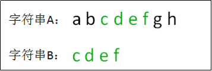
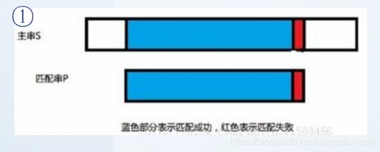
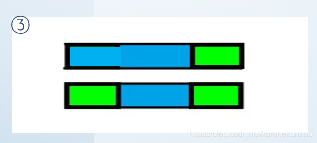
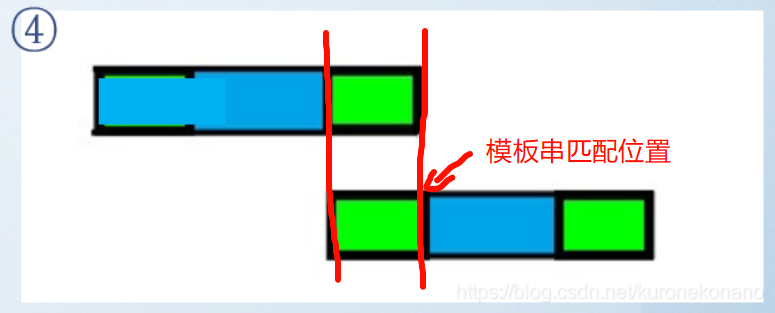
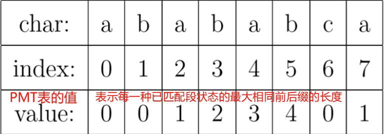
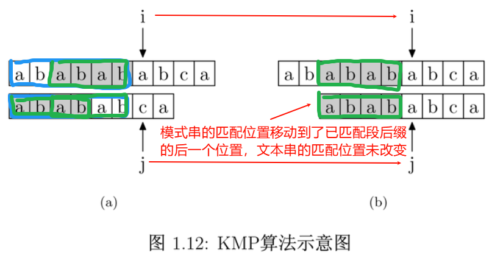
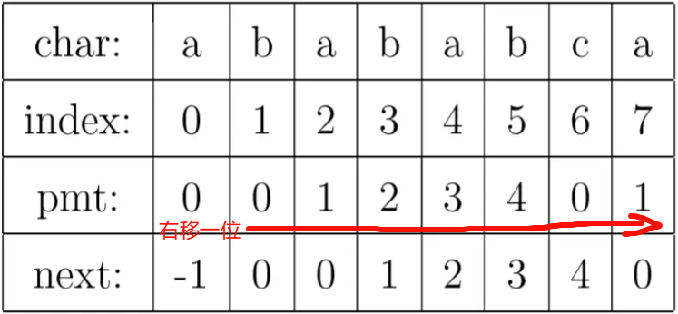

# KMP 算法

## 引言

### 字符串匹配问题的概念

给定一个主串和模式串，要求判断模式串是不是主串中的子串。

<font style="color:rgb(34, 34, 34);"> 在这种问题中，我们一般将短的字符串称为 </font> **<font style="color:rgb(34, 34, 34);"> 模式串 </font>** <font style="color:rgb(34, 34, 34);">，将长的字符串称为 </font> **<font style="color:rgb(34, 34, 34);"> 文本串。</font>**



可以看出，<font style="color:rgb(34, 34, 34);"> 字符串 B 在字符串 A 中出现的位置为 2，因此返回结果为 2。</font>

### 解决字符串匹配问题的算法

解决字符串匹配问题的算法很多，大致有 BF(暴力破解)算法，KMP 算法，Boyer-Moore，Sunday 算法等。其中比较著名的算法为 KMP 算法，这里稍微记录一下 **目前** 我个人对 KMP 算法的理解。

## 朴素方法(暴力匹配)

### 基本思路

顾名思义，这种方法不关注任何信息，**直接枚举文本串中的匹配起始点**。

+ 若文本串中 **当前** 匹配点上的字符与模式串中当前匹配点对应的字符相同，则将两个串的匹配点后移。
+ 若不同，则重置模式串中的匹配点至模式串起始位置，并重新枚举文本串中的匹配点。
+ 过程持续至文本串的匹配点或模式串中的匹配点超过其长度。

示例代码如下所示：

```java
class Solution {
    public int strStr(String ss, String pp) {
        int n = ss.length(), m = pp.length();
        char[] s = ss.toCharArray(), p = pp.toCharArray();
        // 枚举原串的匹配起始点
        for (int i = 0; i <= n - m; i++) {
            // 从原串的匹配起始点和匹配串的起始位置开始，尝试匹配
            int a = i, b = 0;
            while (b < m && s[a] == p[b]) {
                a++;
                b++;
            }
            // 如果能够完全匹配，返回原串的匹配起始点下标
            if (b == m) return i;
        }
        // 找不到，返回-1
        return -1;
    }
}
```

### 时间复杂度分析

若文本串的长度为 $ n $，模板串的长度为 $ m $，则时间复杂度容易达到 $ O(n * m) $ 这个量级。

> 最坏情况下需要枚举 $ n(或n - m)次 $，枚举的长度最坏情况下可以达到 $ (m - 1) $ 次
>

## KMP 算法

### KMP 算法介绍

<font style="color:rgb(34, 34, 34);"> Knuth-Morris-Pratt 算法是一种比较高效的字符串匹配算法，它能够以 </font> $ O(n + m) $ <font style="color:rgb(34, 34, 34);"> 的时间复杂度解决 "找到子串出现在主串中第一次出现的位置" 这类问题。KMP 算法对 BF 算法中舍弃掉的匹配信息加以利用，这一点是 KMP 算法相比于朴素算法的优化核心。</font>

### 个人对 KMP 算法原理的大致理解
>
> 这部分会借用一些大佬的图加以解释
>

相比于 BF 算法将之前产生的匹配信息全部扔掉，KMP 算法则将产生的匹配信息进行了利用，**减少了模板串匹配指针的回溯程度，同时让文本串的匹配指针不进行回溯**。

KMP 算法的执行步骤大致如下：

1. 初始的匹配过程与 BF 一致，相同则匹配点后移
2. 若发现不匹配，先取之前匹配的部分：  
  
然后在先前匹配成功的蓝色部分中，得出该蓝色部分字串对应的 **<font style="color:rgb(34, 34, 34);"> 最长相同前后缀 </font>** <font style="color:rgb(34, 34, 34);">(</font> **<font style="color:rgb(34, 34, 34);"> 绿色 </font>** <font style="color:rgb(34, 34, 34);"> 区域)</font>：  
   
最后将模式串 "后移" 至前缀与文本串的后缀相同的部分(其实是通过 **移动模板串匹配点至蓝色区域前缀的后一个字符处** 来等效实现的，文本串匹配点 **无需回溯**)  

3. 若成功匹配模板串，则返回文本串匹配点对应的下标；否则返回-1。

在对 KMP 算法的原理进行分析过后，可以发现该算法实现的核心要点在于：

**在匹配失败时，获取已匹配段的** **<font style="color:rgb(34, 34, 34);"> 最长相同前后缀信息，以让模板串匹配位置尽可能少回溯的同时，无需让文本串匹配位置回溯。</font>**

<font style="color:rgb(34, 34, 34);"> 那么如何获得已匹配段的最长相同前后缀信息呢？</font>

<font style="color:rgb(34, 34, 34);"> 通过上面的分析，我们可以得到以下两点：</font>

1. 已匹配段一定是 **模板串的子串，** 也一定是 **文本串的子串**。
2. 模板串是固定的 => 对于模板串的每一个元素来说，它之前的所有元素组成的子串是固定的。

因此，对于已匹配段的任意一种 **状态**，已匹配段的最长相同前后缀信息是 **固定** 的。

> 状态：此处指已匹配段的 **长度** 取值情况
>

既然这个信息是 **固定且不受文本串影响** 的，那么我们就可以先对这个信息进行 **预处理**，等到匹配失败的时候使用得到的信息对模板串匹配位置的回溯进行优化即可。

### 部分匹配表 PMT 与 Next 数组

要得出 **每一个** 已匹配段状态对应的最长相同前后缀信息，我们需要 **枚举** 每一种已匹配段状态，得出其对应的最长相同前后缀信息，并存储到一个数据结构中，方便之后取用信息。

而在 KMP 算法中，部分匹配表 PMT 就起到了存储每一种已匹配段状态所对应的信息的作用。

#### PMT 表的生成(人工法)

举个例子，对于字符串 "abababca"，它的 PMT 表取值如下：



如上图所示，可以发现，**<font style="color:rgb(25, 27, 31);"> PMT 中的值就是当前 </font>** **已匹配段状态** **<font style="color:rgb(25, 27, 31);"> 的前缀集合与后缀集合的交集中最长元素的长度。</font>**

<font style="color:rgb(25, 27, 31);"> 例如 </font> 已匹配段状态为 <font style="color:rgb(25, 27, 31);"> "ababab" 时，其 </font> **<font style="color:rgb(25, 27, 31);">(真)</font>** <font style="color:rgb(25, 27, 31);"> 前缀集合为 </font> $ \{ a, ab, aba, abab, ababa\} $ <font style="color:rgb(25, 27, 31);">，</font> **<font style="color:rgb(25, 27, 31);">(真)</font>** <font style="color:rgb(25, 27, 31);"> 后缀集合为 </font> $ \{ b, ab, bab, abab, babab \} $ <font style="color:rgb(25, 27, 31);">，它们的交集为 </font> $ \{ ab, abab \} $ <font style="color:rgb(25, 27, 31);">，交集中最长元素的长度为 </font> $ 4 $ <font style="color:rgb(25, 27, 31);">，因此下标为 5 的字符 b 对应的 PMT 表取值为 </font> $ 4 $ <font style="color:rgb(25, 27, 31);">。</font>

#### 如何使用 PMT 表加速字符串的查找
>
> 本部分内容借鉴了 [该问题](https://www.zhihu.com/question/21923021/answer/281346746) 中大佬的回答
>

如下图所示，要在文本串 "ababababca" 中查找模式字符串 "abababca"。

如果在 j 处字符不匹配，那么由于模式字符串 PMT 的性质，文本串中 i 指针之前的 PMT [j −1] 位 **(文本串中已匹配串的后缀)** 就一定与模式字符串的第 0 位至第 PMT [j−1] 位 **(模板串中已匹配串的前缀)** 是相同的。

这是因为文本串在 i 位失配，也就意味着文本串从 i−j 到 i 这一段是与模板串的 0 到 j 这一段是完全相同的。而我们上面也解释了，模板串从 0 到 j−1 ，在这个例子中就是”ababab”，其真前缀集合与真后缀集合的交集的最长元素为”abab”， 长度为 4。

所以就可以断言，文本串中 i 指针之前的 4 位一定与模式字符串的第 0 位至第 4 位是相同的，即长度为 4 的后缀与前缀相同。这样一来，我们就可以将这些字符段的比较省略掉。**具体的做法是，保持 i 指针不动，然后将 j 指针指向模板串的 PMT [j −1] 位即可。**

简言之，以图中的例子来说，在 i 处失配，那么文本串和模板串的前边 6 位就是相同的。又因为模板串的前 6 位，它的前 4 位前缀和后 4 位后缀是相同的，所以我们推知文本串 i 之前的 4 位和模板串开头的 4 位是相同的。就是图中的灰色部分。那这部分就不用再比较了。



<font style="color:rgb(138, 143, 141);">(注意：图中描述的 "已匹配段" 实为 </font> **<font style="color:rgb(138, 143, 141);"> 文本串中的已匹配段 </font>** <font style="color:rgb(138, 143, 141);">，不是模板串的)</font>

有了上面的思路，我们就可以使用 PMT 加速字符串的查找了。我们看到如果是在 j 位 失配，那么影响 j 指针回溯的位置的其实是第 j −1 位的 PMT 值，所以为了编程的方便， 我们不直接使用 PMT 数组，而是将 PMT 数组向后偏移一位。我们把新得到的这个数组称为 **Next 数组**。

其中要注意的一个技巧是，在把 PMT 进行向右偏移时，第 0 位的值，我们将其设成了-1，这只是为了编程的方便，并没有其他的意义。在上面提到的例子中，Next 数组如下表所示。



下面给出根据 Next 数组进行字符串匹配加速的字符串匹配示例程序：

```java
public static int KMP(String text, String pattern) {
    int i = 0; // 文本串指针
    int j = 0; // 模式串指针
    int[] next = new int[pattern.length()]; // 初始化 Next 数组
    getNext(pattern, next); // 生成 Next 数组

    while (i < text.length() && j < pattern.length()) {
        if (j == -1 || text.charAt(i) == pattern.charAt(j)) {
            i++; // 匹配成功，文本串和模式串指针同时后移
            j++;
        } else {
            j = next[j]; // 失配时，使用 Next 数组跳转
        }
    }

    if (j == pattern.length()) {
        return i - j; // 匹配成功，返回匹配起始位置
    } else {
        return -1; // 未匹配
    }
}
```

#### 如何通过编程快速获取 Next 数组？

在 3.3.2 节中我们已经了解了 PMT 表与 Next 数组之间的关系，只要能求得 PMT 表，就能够求出 Next 数组。

上文中 PMT 表的定义为：<font style="color:rgb(25, 27, 31);"> PMT 中的值就是当前 </font> 已匹配段状态 <font style="color:rgb(25, 27, 31);"> 的前缀集合与后缀集合的交集中最长元素的长度。</font>

<font style="color:rgb(25, 27, 31);"> 那么，获取 PMT 表的过程，相当于模板串自身和自身进行匹配的过程。</font>

<font style="color:rgb(25, 27, 31);"> 为了方便，我们一般都略过求 PMT 表的过程，直接求解 Next 数组，其实原理也是一样的。</font>

<font style="color:rgb(25, 27, 31);"> 直接求解 Next 数组的大致思路描述如下：</font>

<font style="color:rgb(25, 27, 31);"> 令一份模板串为文本串，然后从模板串下标为 1 的位置进行匹配(可以这么理解：PMT 表右移一项就是 Next 表了)，在任一位置，</font> **<font style="color:rgb(25, 27, 31);"> 能匹配的最长长度 </font>** <font style="color:rgb(25, 27, 31);"> 就是当前位置的 Next 值。</font>

<font style="color:rgb(25, 27, 31);"> 获取 Next 数组的示例代码如下：</font>

```java
public static void getNext(String pattern, int[] next) {
    next[0] = -1; // 初始化 Next 数组的第一个值
    int i = 0, j = -1; // i 指向当前字符，j 指向最大相同前后缀长度

    while (i < pattern.length() - 1) { // 遍历模式串
        if (j == -1 || pattern.charAt(i) == pattern.charAt(j)) {
            i++;
            j++;
            next[i] = j; // 记录最大相同前后缀长度
        } else {
            j = next[j]; // 如果不匹配，则回溯 j
        }
    }
}

```

## 总结

+ **KMP 算法的优势** 在于减少了无效的比较，使得模式串的匹配指针尽可能少地回溯，而文本串的指针则无需回溯。
+ **常见问题与难点：** 如何生成 PMT 表和 Next 数组？关键在于理解前缀和后缀的概念，以及如何通过匹配信息来优化下一步的匹配。
