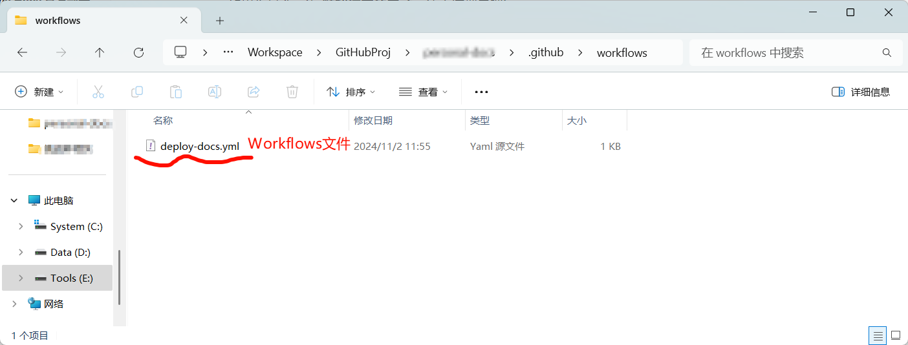
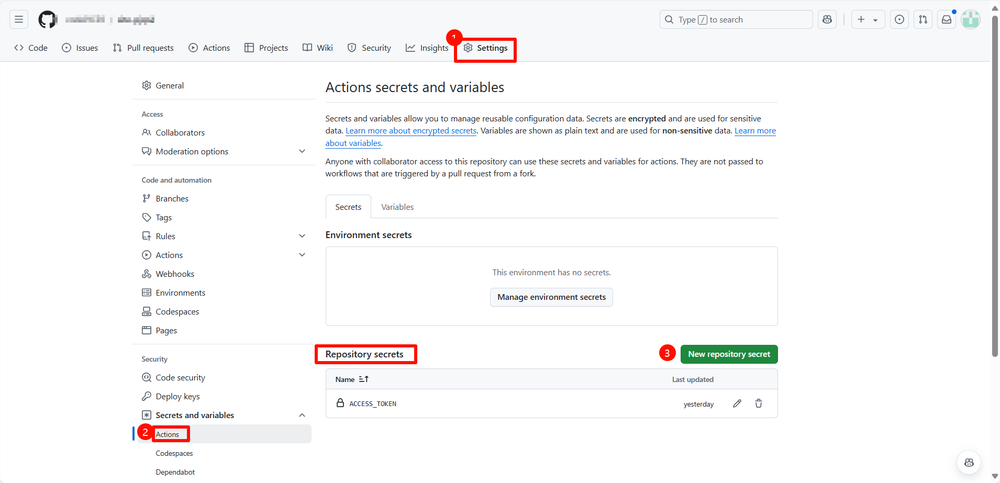
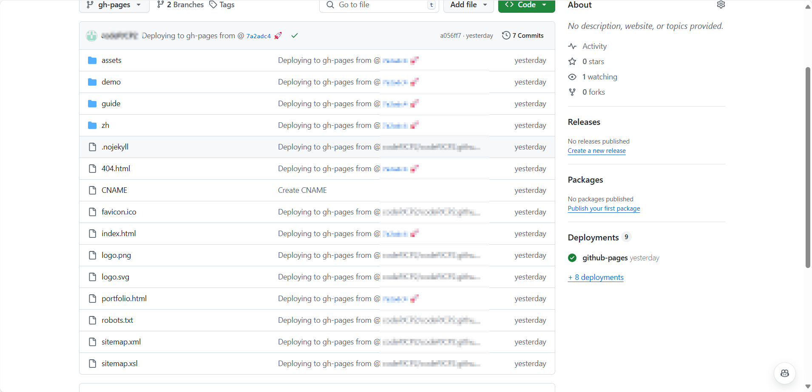
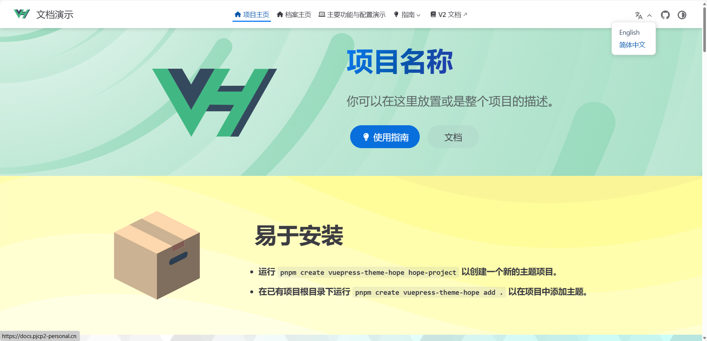
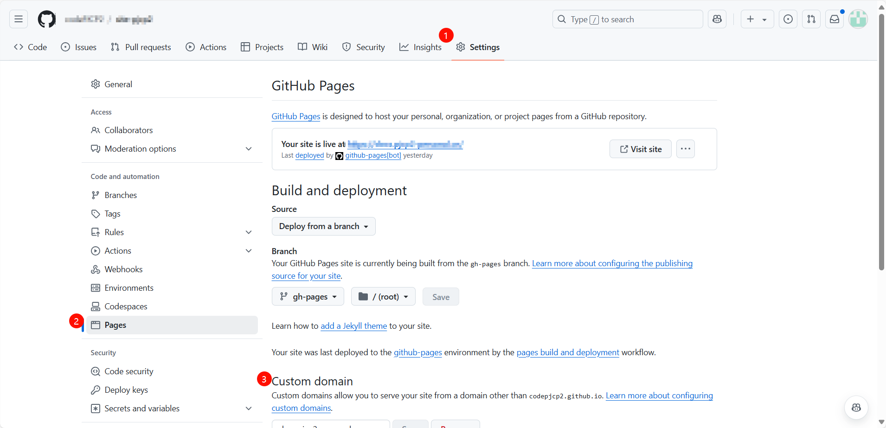

> 是的，这是我的第一份 Markdown 文档

<!-- more -->

## 为什么想要搞一个个人网站

~~这不是CSer一般都想有的东西吗~~

## 部署网站时遇到的一系列坑

::: info 这是说明

如果你也是个小白，那你可找错人了XD...

这一部分记录了一些我在部署该博客的时候遇到的一系列坑。

~~如果你是个一次 **顺利搞定的天才**，请火速划走吧!~~

:::

### Vue Press 与 Vue Press Theme Hope

本网站使用 [VuePress](https://www.vuepress.cn/) 这个静态网站生成器进行生成，使用它的主要原因是 **本人相对来说比较熟悉 Vue 的语法**。

_Vue Press_ 中对原生 Markdown 已经有了内置的扩展，同时对 Vue 也包含原生支持。

然而， 对 _Markdown_ 的扩展是 **没有极限** 哒! 因此我选用了 [Vue Press Theme Hope](https://theme-hope.vuejs.press/zh/) 这一增强主题作为网站的主题。

_Theme Hope_ 对 _Vue Press_ 进行了进一步扩展，捆绑了一些常用扩展插件，并且降低了配置难度。萌新也能够更好上手！

### 项目部署关键点

>   本节参考资料：[部署项目 | vuepress-theme-hope](https://theme-hope.vuejs.press/zh/get-started/deploy.html#部署到-github-pages)

#### push 之前的操作

在创建完  *Vue Press Theme Hope* 的[项目模板](https://theme-hope.vuejs.press/zh/get-started/create.html#_2-%E5%88%9B%E5%BB%BA%E9%A1%B9%E7%9B%AE%E6%A8%A1%E6%9D%BF)后，模板中会自动包含用于自动部署文档的 GitHub Workflow 文件。



```yaml title="deploy-doc.yml"
name: 部署文档

# 设置推送到 main 分支的时候进行构建
on:
  push:
    branches:
      - main

permissions:
  contents: write

jobs:
  deploy-gh-pages:
    runs-on: ubuntu-latest
    steps:
      - name: Checkout
        uses: actions/checkout@v4
        with:
          fetch-depth: 0
          # 如果你文档需要 Git 子模块，取消注释下一行
          # submodules: true


      - name: 设置 Node.js
        uses: actions/setup-node@v4
        with:
          node-version: 20
          cache: npm

      - name: 安装依赖
        run: |
          corepack enable
          npm ci

      - name: 构建文档
        env:
          NODE_OPTIONS: --max_old_space_size=8192
        run: |-
          npm run build
          > docs/.vuepress/dist/.nojekyll

      - name: 部署文档
        uses: JamesIves/github-pages-deploy-action@v4
        with:
          # 部署文档
          branch: gh-pages
          folder: docs/.vuepress/dist
        env:
          GITHUB_TOKEN: ${{ secrets.ACCESS_TOKEN }}
```

上面是我本地已经修改完成的一个 `deploy-docs.yml` 示例。需要注意的是部署的时候需要仓库的 `token` 来进行操作，否则在 `Actions` 过程中可能构建失败。

要创建一个仓库专属的 `secret` (token) ，你可以前往仓库的 `Settings -> Secrets and variables -> Repository Secrets` 选项中进行设置。



创建成功以后，请妥善保管。`${{ secrets.ACCESS_TOKEN }}` 会自动获取仓库中的 `ACCESS_TOKEN` 密钥并进行填充。

在 push 之前，请先再检查一下你的 `.vuepress/config.ts` 中的 *base* 设置：

-   如果你准备发布到 `https://<USERNAME>.github.io/`，你必须将整个项目上传至`https://github.com/<USERNAME>/<USERNAME>.github.io` 仓库。在这种情况下你无需进行任何更改，因为 *base* 默认就是 `"/"`。
-   如果你的仓库地址是一个普通的形如 `https://github.com/<USERNAME>/<REPO>` 的格式，网站将会被发布到 `https://<USERNAME>.github.io/<REPO>/` ，也就是说，你需要将 *base* 设置为 `"/<REPO>/"`。

```ts title=".vuepress/config.ts"
export default defineUserConfig({
    base: "/",	// 根据如上要求修改
    // ...
    // Codes below are hidden.
});
```

在检查完成之后，你就可以尝试着将项目 push 到仓库里了！

#### push 之后的操作

在你成功 push 之后，你可以进入到仓库的 `Actions` 选项卡中，查看所有 *Workflows* 。如果你当次推送的 *Workflows* 成功执行，那么你的项目部署已经成功完成了。正常情况下，你可以发现仓库中新增了一个 `gh-pages` 分支，里面的内容是项目 *build* 之后的结果，包含了转换成的静态网页：



当操作完成后，你应该前往 GitHub 仓库的设置页面，选择 `gh-pages` 作为 GitHub Pages 的源，这样访问 `https://<username>.github.io` (也就是你的**默认个人主页**) 就可以看到 `gh-pages` 分支下的 `index.html` 页面的内容。



### 使用你的自定义域名来访问 _Github Pages_

::: warning

如果你没有域名，可以选择：

-   忽略这一模块

-   前往一些运营商或者云服务提供商处进行购买。

:::

前往部署该项目的 `Settings -> Pages -> Custom Domain` 选项来进行进一步设置。



配置详情参见 [配置 GitHub Pages 站点的自定义域 - GitHub 中文文档](https://docs.github.com/zh/pages/configuring-a-custom-domain-for-your-github-pages-site)。

### 参照 _Theme Hope_ 官方部署示例的一些隐藏问题