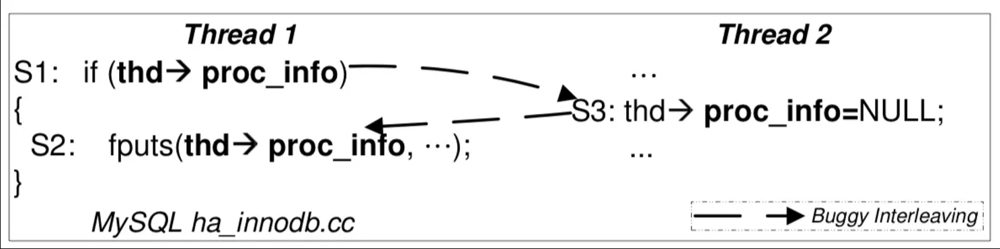
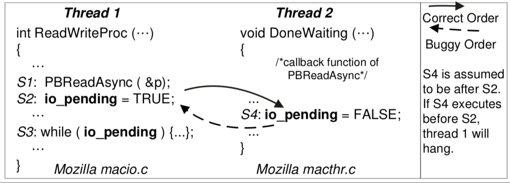

> **背景回顾**：当我们在写程序的时候，我们其实是在写 bug。时至今日，我们还没有有效、方便的技术能帮助我们快速构建可靠的软件系统。并发 bugs “若隐若现” 的特性又导致它们经常逃脱开发人员的掌控。
>

**本讲内容**：常见的并发 bugs：死锁、数据竞争、原子性和顺序违反。

<!-- more --->

## 死锁

> A deadlock is a state in which each member of a group is waiting for another member, **including itself**, to take action.

### AA-deadlock

> 自己锁自己

```C title="AA型死锁的示例"
lock(&lk);
// ...
lock(&lk);
```

一种很好的解决方法：
```C title="xv6中的防御性编程"
void lock(mutex_t *lock)
{
    // 一旦试图获取已上锁的锁，直接报错
    if(lock->hold)
        panic();
    // ...
}
```

### ABBA-deadlock

> 一个线程提前拿走了某一线程后续需要用到的资源

```C title="ABBA型死锁"
void thread_1(mutex_t *a, mutex_t *b)
{
    lock(a);
    lock(b); // <-- Deadlock occurs here
}

void thread_2(mutex_t *a, mutex_t *b)
{
    lock(b);
    lock(a);  // <-- Deadlock occurs here, too
}
```

例如我们上节课所讲到的 [哲♂学家吃饭问题](./sync(2).md#更复杂的同步条件 —— 哲学家吃饭问题) ：

```C title="ABBA死锁产生示例"
void T_philosopher() {
    P(&avail[lhs]);
    P(&avail[rhs]);
    // ...
    V(&avail[lhs]);
    V(&avail[rhs]);
}
```

- $T_1$: P(0) - 成功, P(1) - 等待
- $T_2$: P(1) - 成功, P(2) - 等待
- $T_3$: P(2) - 成功, P(3) - 等待
- $T_4$: P(3) - 成功, P(4) - 等待
- $T_5$: P(4) - 成功, P(0) - 等待

- 然后...所有线程都在等待其余资源释放

### 死锁产生的 *必要条件*

> 参考论文链接：[System deadlocks (1971)](https://dl.acm.org/doi/10.1145/356586.356588)

如果我们把锁看成袋子里面的球 !!其实就是我们上节课中提到的信号量 $n = 1$ 的特殊情况!! ，那么死锁产生的必要条件可以叙述如下：

1. Mutual-exclusion - 一个口袋一个球，**得到球才能继续**
2. Wait-for - 得到球的人想要 **更多的球**
   1. 可能的解决方案：!!原子存取资源 —— "一把大锁保平安"!!

3. No-preemption - **不能** 抢别人的持有的球
   1. !!获取一连串的锁时，如果存在失败，则 Undo 先前所做的所有操作并从头尝试重新获取锁!!

4. Circular-chain - 形成 **循环等待** 球的关系

- 既然上面的条件是死锁产生的 **必要条件**，那么是不是只需要 **打破其中一个** 就可以避免死锁现象了？
  - 对于真实的系统来说，最能够打破的应该是哪个呢？


### 实际系统中避免死锁的一些方法

对于实际系统来说，最容易打破的条件当然是 **循环链** 。

由于循环链在复杂工程当中可能经常会被我们不经意触发，我们可以使用 ***Lock Ordering*** 这一方式来防止死锁：

- 任意时刻系统中的锁都是有限的
- 给所有锁编号 (***Lock Ordering***)
  - 严格按照某种特定的顺序获得锁
    ```C title="Example of Lock Ordering"
    void do_something(mutex_t* m1, mutex_t* m2)
    {
        if(m1 > m2)
        {
            pthread_mutex_lock(m1);
            pthread_mutex_lock(m2);
        }
        else
        {
            pthread_mutex_lock(m2);
            pthread_mutex_lock(m1);
        }
    }
    
    do_something(m1, m2);
    // equals to do_something(m2, m1), thus doesn't results into ABBA deadlock
    ```
  
    

::: details 为什么？(证明)

- 任意时刻，总有一个线程获得 “编号最大” 的锁
- 这个线程总是可以继续运行

:::

## 数据竞争 (*data race*)

> ~~不上锁不就可以避免死锁了？~~

不上锁可能会带来另一种并发问题 —— 数据竞争 (***data race***)。

::: info 什么是数据竞争

**不同的线程**同时访问**同一内存**，且**至少有一个是写**。--> 引入非确定 (Indeterminate) 的结果

- 两个内存访问在 “赛跑”，“跑赢” 的操作先执行
- 例子：共享内存上实现的 *Peterson* 算法

::: danger 不要尝试在代码中引入明显的 *data race* !

> [data race is undefined behavior](https://en.cppreference.com/w/c/language/memory_model)

Undefined behavior 很可能会带来严重的后果！

:::

### 常见的引入数据竞争的几种例子

- Case 1: 上错了锁

```C title="我大锁呢？"
void T_1() { spin_lock(&A); sum++; spin_unlock(&A); }
void T_2() { spin_lock(&B); sum++; spin_unlock(&B); }
```

- Case 2: 忘记上锁

```C title="忘记上锁"
void T_1() { spin_lock(&A); sum++; spin_unlock(&A); }
void T_2() { sum++; }
```

除了上面的几种常见情况以外，数据竞争还发生在许多实际场景中，因为：

- “内存” 可以是地址空间中的 **任何内存**
  - 可以是全部变量
  - 可以是堆区分配的变量
  - 可以是栈
- “访问” 可以是 **任何代码**
  - 可能发生在你的代码里
  - 可以发生在框架代码里
  - 可能是一行你没有读到过的汇编代码
  - 可能是一条 `ret` 指令

### 面对数据竞争的两大原则

- 用锁保护好共享数据
- 消灭一切数据竞争！

> 相当多的并发 bugs 最终都会体现为数据竞争。对于并发编程的初学者，除了在主观上避免数据竞争之外，也要记得忘记上锁、上错锁、在临界区外访问共享资源都可能导致数据竞争。

## 原子性/顺序违反

### 并发编程的本质困难

- 人类是彻彻底底的 *sequential creature*
  - 我们理解程序的基本单元总是 "一块一块"

- **并发控制的机制完全是 “后果自负” 的**

  - 互斥锁 (lock/unlock) 实现原子性
    - 忘记上锁——原子性违反 (Atomicity Violation, AV)

  - 条件变量/信号量 (wait/signal) 实现先后顺序同步
    - 忘记同步——顺序违反 (Order Violation, OV)

- **97% 的非死锁并发 bug 都是原子性或顺序错误**

### 原子性违反 (*AV*)

在并发程序下，出现了类似 "ABA" 的调度：

> “ABA”: 代码被别人 “强势插入”

- 即便分别上锁 (消除数据竞争)，依然是 *AV*
  - 《暗黑破坏神 I》里复制物品的例子
  - `Therac-25` 中 “移动 Mirror + 设置状态”



### 顺序违反 (*OV*)

“BA”: 事件未按预定的顺序发生 **(A happens before B 的假设被破坏了)**

- 例子：concurrent use-after-free



## 总结

人类本质上是 sequential creature，因此总是通过 “块的顺序执行” 这一简化模型去理解并发程序，也相应有了两种类型的并发 bugs：

- Atomicity violation，本应原子完成不被打断的代码被打断
- Order violation，本应按某个顺序完成的未能被正确同步

与这两类 bugs 关联的一个重要问题是 **数据竞争**，即两个线程同时访问同一内存，且至少有一个是写。数据竞争 **非常危险**，因此我们在编程时要尽力避免。
