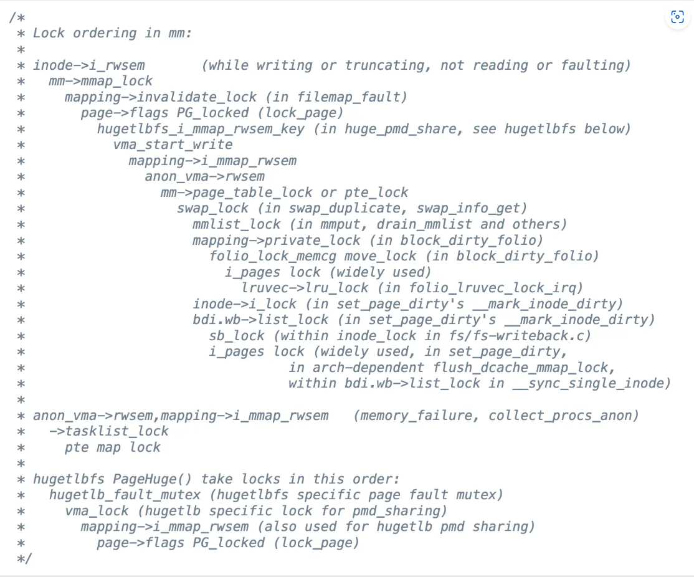
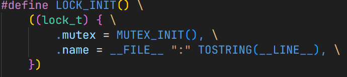
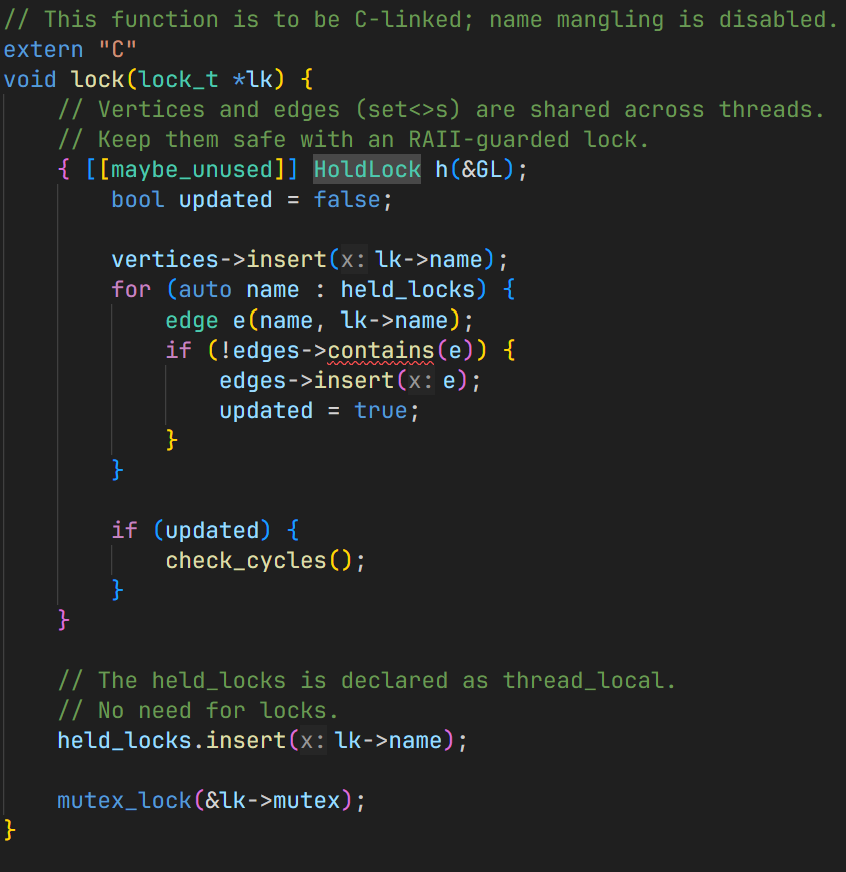
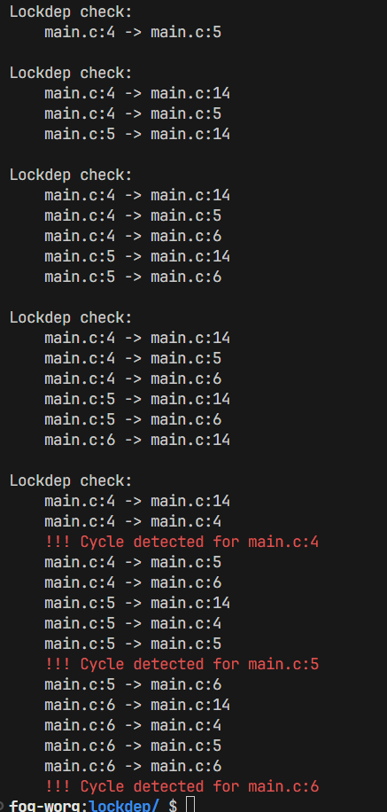

> **背景回顾**：我们已经了解常见的并发 bug 类型：死锁、数据竞争、原子性/顺序违反。与此同时，在编程时消灭并发 bug 仍然是一个世界性的难题。那么，我们应该如何应对这些并发 bugs？

**本讲内容**：**另一节真正的实用 “编程” 课** —— 如何正确地 (并发) 编程：应对三种常见的 “死亡” 方式：

- 死锁 (deadlock)
- 死局 (软件危机中的 dead end)
- 死线 (deadline)

<!-- more --->

## 应对死锁

死锁其实是一类比较 "容易" 且 "明确" 的并发 bug :

- 它容易被观测
- 针对避免该 bug 的正确性具有明确的标准：
  - 任何线程在 “基本合理” 的调度下，不能失去进展
- 它甚至有明确的必要条件
  - Mutual-exclusion - 一个口袋一个球，得到球才能继续
  - Wait-for - 得到球的人想要更多的球
  - No-preemption - 不能抢别人的持有的球
  - Circular-chain - 形成循环等待球的关系 (相对容易破坏的条件)
- ...

为了避免死锁，我们在上节课也提到了可以采用 ***Lock Ordering*** 的方式来保证至少有一个线程可以执行。

对 ***Lock Ordering*** 的一个典型应用就是 Linux 中的 `mm/rmap.c`：



你会发现，为了追求性能与程序正确性之间的平衡，我们似乎正在走入一个死局：

**一面是复杂的系统，另一面是不可靠的人**

- 我们希望的
  - 标记 “做一件事” 不被打断
- 实际需要做的
  - “做一件事” 需要拆解成多个步骤
  - 每个步骤需要上正确 (而且尽可能少) 的锁
  - ↑ 为了程序的高性能，我们带来了诸多复杂性...这些复杂性使得我们程序的正确性更加难以验证

## 应对死局 —— 绝处逢生

应对上述正确性的死局，程序员们想到了一个能够自救的办法：

在 **运行时** 检查 bugs 的 **Specifications** 就可以了：

- AA/ABBA 型死锁
- 数据竞争
- 带符号整数溢出 (undefined behavior)
- Use after free
- ……

实际上，我们在调试的时候，也会使用各种方式 (包括但不限于 `printf`、 `display` 、 `bt` 等) 查看状态机内部的一些信息或者调用堆栈等等。

归根结底，我们在使用这些方式调试的时候都是想知道状态机在哪几步可能出现了问题 —— 我们在观测状态机某一时刻的状态与历史的状态轨迹。

因此，我们引入了 **动态程序分析** 这一 "自动化" 自救方法：

(每次状态迁移时，) 调用以 **状态机执行历史** 为输入的分析函数 $f(\tau)$ 来检查 bugs 对应的 **Specifications** ：

- 虽然要付出程序执行变慢的代价
- 但是可以帮我们找到更多 bugs

### 运行时的死锁检查

由于 "AA" 型死锁我们可以通过类似于 *xv6* 中的防御性编程来实现检查，那么剩下需要检查的死锁仅为 "ABBA" 型。

"ABBA" 型死锁的锁获取顺序 **在图的意义上是个环**，因此我们有一个想法：

- 为每一个 *acquire* / *release* 记录 `tid` 和 `lock_name` (记录线程上锁/解锁的信息)
- Assert: $G(V,E)$ 无成环
  - $V$: 所有的 `lock_name`
  - $E$: 每当观测到持有 $u$ 时获取 $v$ 就把 $(u, v)$ 加入 $E$

```c title="记录线程上锁/解锁信息"
T1 ACQ a
T1 ACQ b
T1 REL b
T2 ACQ b
T2 REL b
...
```

那我们只需要动态维护锁的持有图，并且时刻检查锁持有图中 **是否存在环**，就可以得到我们的 **运行时死锁检查程序**！

::: info 如果想要更高效一些呢?

- 真的需要时刻动态维护结点吗？
- 真的需要时刻检查图中是否成环吗？
- 这样的开销会不会非常大？

::: details "工程师的智慧"

- 将每个文件中每一行上的锁 **全部认为是一个锁**
  - (待解答：为什么这么做是可行的，而不用去管具体的线程信息? :dizzy_face: )
    - 也许不用管具体的调度？只需要明确存在一个可能的调度序列能够产生死锁即可？



- 仅在 **上锁且锁图更新** 的时候检查是否成环



:::



### 运行时的数据竞争检查

对于数据竞争，我们也有一个明确的 **Specification** :

> 数据竞争：**不同的线程**同时访问**同一内存**，且**至少有一个是写**。

即使某些线程看起来能够与其余线程错开，但是数据竞争是仍然可能发生的 —— 这几个线程之间不存在 *happens before* 关系。

例如下面的例子：

```C title="看起来存在 happens-before 的代码"
void T_1() { 
    spin_lock(&A); 
    sum++; // <-- data race occurs
    spin_unlock(&A); 
}
void T_2() { 
    for(int i = 0; i < N; i++)
        y++;
    spin_lock(&B); 
    sum++; // <-- data race occurs
    spin_unlock(&B); 
}
```

因此我们采用如下方法来检查是否存在数据竞争：

::: center

对于发生在不同线程且至少有一个是写的 $x, y$ ，检查 $x \prec y \lor y \prec x$

:::

> 大致意思：利用 *acquire* / *release* 所产生的 *happens before* 关系来形成具有传递关系的图，在这个图所表明的先后关系这一约束条件下，如果我们能找到没有约束的两个内存访问，且这两个访问发生在不同线程，并且至少有一个是写，那么程序中存在 *data race*。
>
> ~~(这个图生成的我不是很懂，故略过)~~

## 应对死线 —— 防御性编程

你可能已经见识过下面这些 *Sanitizers* 的实力，~~并且非常想把它搬到你的操作系统实验里面去~~：

- Address Sanitizer (`asan`)
  - Buffer (heap/stack/global) overflow, use-after-free, use-after-return, double-free, ...;
  - 没有 [KASAN](https://www.kernel.org/doc/html/latest/dev-tools/kasan.html), Linux Kernel 的质量/安全性直接崩盘
- Thread Sanitizer (`tsan`): 数据竞争
  - KCSAN: [Concurrency bugs should fear the big bad data-race detector](https://lwn.net/Articles/816850/)
- [Memory Sanitizer](https://clang.llvm.org/docs/MemorySanitizer.html) (`msan`), [UBSanitizer](https://clang.llvm.org/docs/UndefinedBehaviorSanitizer.html) (`ubsan`), ...

很不幸，移植不太容易成功。

那我们能不能做一个丐版的呢？:thinking:

- 不实现完整的检查，但是可以帮我们检查出大部分的错误
- `assertions` 就是一个简单方便的选择！

当然，在看完金丝雀的故事之后(这里就不放了，感兴趣的话自行前往 [Lec13](https://jyywiki.cn/OS/2024/lect13.md) 查看)，也许你会认为 **放置哨兵** 这种思路也是不错的选择。

### 防御性编程(1): 低配版 *Lockdep*

我们可以不断统计自旋的次数，如果次数达到了一个很高的上限值 `SPIN_LIMIT `，那么我们就抛出错误信息。

结合断点与 `backtrace`，也许能够帮你快速找到死锁的源头。

```C title="在几秒之内检查死锁"
int spin_cnt = 0;
while (xchg(&lk, ❌) == ❌) {
    if (spin_cnt++ > SPIN_LIMIT) {
        panic("Spin limit exceeded @ %s:%d\n",
            __FILE__, __LINE__);
    }
}

// ...

(gdb) b 4
(gdb) bt
    ...
```

### 防御性编程(2): 低配版 *Address Sanitizer*

就拿 [L1](https://jyywiki.cn/OS/2024/labs/L1.md) 来举例，如何检查诸如 *double free* 、 *double allocation* 等问题呢？

初始我们可以将未申请过的区域涂上某种颜色的漆，把已经申请过的区域统一 **涂上另一种颜色的漆** (下面统一用 `MAGIC` 表示)，释放掉的区域也同理 (假设涂上 `0` )。

```C title="低配版 Address Sanitizer"
// allocation
for (int i = 0; (i + 1) * sizeof(u32) <= size; i++) {
    panic_on(((u32 *)ptr)[i] == MAGIC, "double-allocation");
    arr[i] = MAGIC;
}

// free
for (int i = 0; (i + 1) * sizeof(u32) <= alloc_size(ptr); i++) {
    // can also detect use-after-free
    panic_on(((u32 *)ptr)[i] == 0, "double-free");
    arr[i] = 0;
}
```

### 防御性编程(3)：低配版 Thread Sanitizer

> 数据竞争并不好进行观测 —— 它可能需要很久以后才 "现形"。同时，想要抓到具体的源头是不容易的。
>
> 因此，我们在这里仅仅试图去验证我们的程序中是否存在数据竞争。

我们可以回顾一下数据竞争产生的原因：

- **不同的线程**同时访问**同一内存**，且**至少有一个是写**。

**写入势必会造成状态机状态的改变** ，因此我们或许可以从观测状态改变入手。

我们可以在保证当前线程不对待观察内存进行修改的情况下 (假设当前处于上锁保护的状态)，对数据进行一对 **"时间跨度较大"** 的观察：

```C title="在较大时间跨度之后观测状态"
// Suppose x is lock-protected

...
int observe1 = x;
delay();
int observe2 = x;

assert(observe1 == observe2);
...
```

如果不存在数据竞争，那么 `assertion` 一定会成立。

(这真的是一个天才的想法！甚至再往前走若干步，就能得到 [Effective data race detection for the Kernel](https://www.usenix.org/legacy/events/osdi10/tech/full_papers/Erickson.pdf) ！)

## 总结

Bugs (包括并发 bugs) 一直以来困扰着所有软件工程的实践者。我们不仅要应对 specification crisis (定义到底什么是对的)，甚至即便知道 specification，也难以应对现代软件的复杂性。为了部分应对这一点从而实现 “更正确” 的软件，我们把对程序的预期表达在程序中 (race-free, lock ordering, ...)，而不是让程序在自然状态下悄悄进入有问题的状态，就是我们目前解决程序调试问题的折中办法。“山寨” sanitizer 给我们带来的启发则是：如果我们能清楚地追溯到问题产生的本源，我们就总是能找到好的应对方法——山寨的 sanitizers 在暗中帮助你实现 fail-fast 的程序，从而减轻你调试问题的负担。希望这节课能启发、帮助你重新思考 “编程” 这件事。

