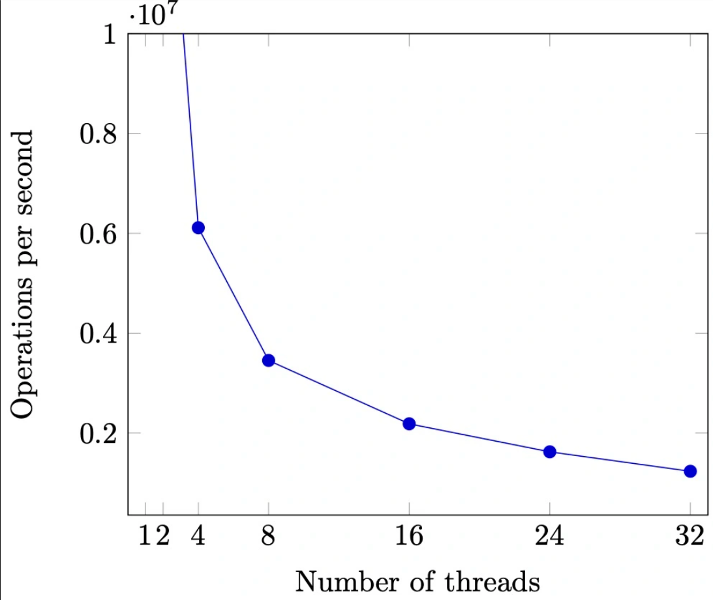
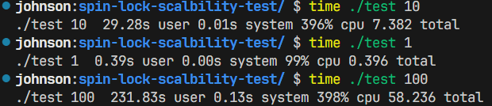
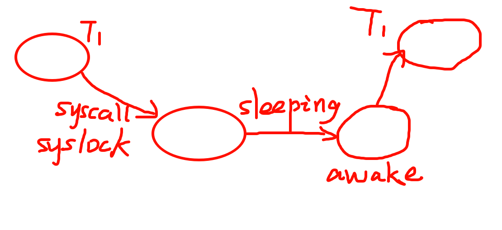
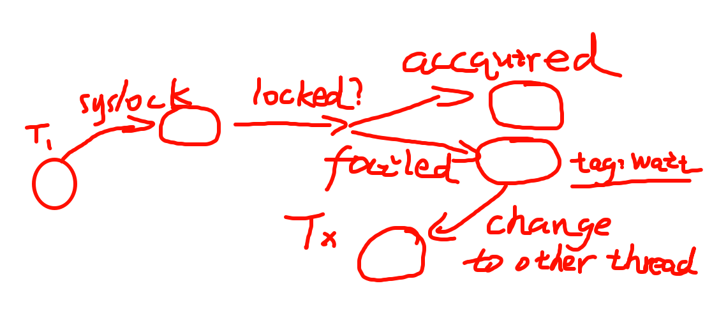

> 背景回顾：我们希望通过互斥实现 *“stop the world”* 的并发控制。在许多在共享内存上实现互斥的失败和成功尝试后，我们意识到软件需要和硬件协同工作，并在 **硬件原子指令** 基础上实现了基础版本的自旋锁。

本节内容：如何分别在 **操作系统内核** 和 **用户态应用程序** 中实现互斥。

<!-- more --->

## 理解并发编程

### 并发编程中的一些可行抽象

- 线程 = 人

- 共享内存 = 物理世界
- Everything is 状态机

### 互斥需要实现的内容

- **Safety**

  - 如果某个线程持有锁，则其他线程的 `lock` 不能返回 (保证该锁的持久唯一性)

  - 能 **正确处理处理器乱序、宽松内存模型和编译优化**

  - 保证持有锁过程中的修改能够令其余线程 **可见** 

- **Liveness**

  - 在多个线程执行 `lock` 时，至少有一个可以返回 （否则就会产生死锁现象）

### 对锁的正确理解

`lock/unlock` 并没有 *“stop the world”* ：

- 上锁仅仅只是保护了 **同一把锁** 保护的代码 
  - 思考一下存在 **多把锁** 的情况

- 即使你正确实现了 `lock/unlock` ，如果锁没有被正确使用，也无法达到预期的 *"stop the world"* 效果
  - 线程 `T1` `T2` 在访问某一段 Critical Section 前均持有锁，但是另一个线程 `T3` 在访问同一段代码时并 **没有先尝试获取锁**...
  
  ```C title="data race"
  lock_t lock;
  long x = 0
  
  // T1 & T2
  spin_lock(&lock);
  // Critical Section
  x++;
  spin_unlock(&lock);
  
  // But for T3...
  // Enters Critical Section without acquiring lock first
  x++;
  ```
  
  

## 操作系统内核中的互斥

### 回顾：计算机系统的状态机模型

- 初始状态
  - *CPU Reset*
- 当前状态
  - 共享内存 + 各个 CPU 内维护的寄存器状态
- 状态迁移
  - 选择任意 CPU
    - 取指执行 **or 响应中断**

::: note :thinking: 如果在执行 Critical Section 的时候，CPU 响应中断了的话，会发生什么情况？

- 也许会出现 **还没有 `unlock` 的时候就被强制执行中断** 的情况
- 如果 **中断后有其余进程想要获取访问该 Critical Section 时需要持有的锁** 呢？
  - 死锁的产生 :scream:

:::

### 正确实现互斥

我们都知道，中断是每个处理器中 **单独** 的事件。而当中断与多处理器同时存在的时候，就像上节最后的情况一样，要正确实现互斥会变得非常棘手：不仅需要考虑处理器间的互斥，还要考虑各个处理器分别发生的中断。

#### 编程之前：正确性准则的设定

当我们接到一个编程任务的时候，我们经常做的第一件事就是 —— IDE，启动！

然后就开始了库库写代码的过程，写完代码之后 Submit 一下或者 Run 一下，看看对不对，如果不对转头修改或重写。

这种情况下，我们并没有预先考虑过 *"这份代码究竟怎样才算对"* ，所以我们总是会在 修改/重写 <-> 验证 这几个步骤之间来回横跳。

为了减少 *"绕圈几率"* ， 我们可以在写代码之前预先设定一系列正确性准则来辅助我们验证程序的正确性，这种方式叫做 **"Test-first programming"** [^Test-first-programming]

[^Test-first-programming]: *测试优先编程* ，详情可见[MIT 6.031 | Reading 3 Testing](https://web.mit.edu/6.031/www/sp21/classes/03-testing/#test-first_programming)

::: info 互斥实现的正确性分析

要设定实现互斥的正确性准则，不妨先从互斥的实现思路开始分析：

- 既然中断会让互斥的实现变得棘手，那么在需要互斥的时候 **关中断** 不就可以了吗？

- 之后，为了确保互斥真正不被中断打扰，那么每次在上锁之前关闭中断，在解锁后立即开启中断，这样不就解决问题了吗？

:::

对于一般情况而言，这种思路是可行的，因为一般情况下进入 Critical Section 的时候，原有的中断状态是开启的，在解锁时候立即开启中断并不会修改进入前后的中断开启状态。

但是对于 **中断处理程序** 等特殊程序而言，为了防止处理中断的过程中再次发生中断，而导致的中断处理程序的重入或执行混乱，中断处理程序通常会在程序执行入口点关闭中断，直到中断处理程序执行完成之后再重启中断。这种机制确保了中断处理的原子性和系统的稳定性。

这种情况下，上述的互斥实现思路就出现了问题 —— 中断处理程序在进入某一段 Critical Section 之后 (此时中断处理程序 **非常有可能尚未执行完成**) ，它的中断被 **打开** 了。这显然不是我们期望的结果 —— 我们希望执行完 Critical Section 之后，中断处理程序的中断仍然是关闭的。

由此，第一条正确性准则就这么被分析出来了 —— **上锁/解锁前后中断状态不变**。

这条正确性原则的内容包括：

- 不得在关中断时随意打开中断 (例如处理中断时)
- 不得随意关闭中断 (否则可能导致 **中断丢失** )

实际编程的过程中，我们也很有可能遇到 Critical Section 套 Critical Section 的情况，例如需要对一个数据结构上的某几个端点进行上锁，之后进行原子修改的情况。

比如说，你需要 lock 一个 (子) 树的根结点与左右结点。这种情况下你想要让对 **两个结点** （子左 & 子右）的修改都被锁保护住，因此你可能会写出与下面的代码类似的代码：

```C title="Nesting of locks"
lock_t a, b, c;

// The following code can't be interrupted
// otherwise it may result in deadlocks
mutex_lock(&a);
mutex_lock(&b);
// Critical Section For b...
mutex_unlock(&b);
mutex_lock(&c);
// Critical Section For c...
mutex_unlock(&c);
mutex_unlock(&a);
```

如果真的沿用上面分析的实现思路来实现并发，那么在与上面的代码类似的 **"锁嵌套"** 情形中，有极大可能会出现死锁的情况。

为了解决这种问题，我们希望在整个 **"锁嵌套"** 情形中，整个处理器的中断状态 (即对应的 *IF Bit*) 不进行改变，达到原子迁移的效果。

要在一系列 Critical Section 执行完毕 (这里特指 **"所有锁释放完成"**) 后，恢复处理器的中断状态。

::: tip 思考

想要恢复中断状态，势必需要将一个待恢复的状态存于某处。

那么它应该存储在哪里呢？ :thinking:

- 一个全局变量 ? !! 它也需要锁来保证操作的原子性；同时，现代计算机结构普遍包含多处理器!!
- 各 CPU 内部 ? !! 状态可以被处理器中的所有线程共享，而且中断状态本身就是对每个 CPU 而言的!!
- 各线程内部 ? !! 中断状态对其余线程是不可见的；假设 CPU 要调整中断状态，各线程内部也需要同步存储原始状态!!

:::

#### 中断的保存与恢复

由于 `lock` 和 `unlock` 通常都是成对出现的，就跟 `()` `[]` 等成对的符号一样。我们可以借助这一特性来完成对中断的恢复操作。

我们可以把 `lock` 与 `unlock` 的操作抽象为对一个 **"锁堆栈"** 的操作：

- 每当 `lock` 的时候，将 **(抽象的)** 锁状态 `push` 进锁堆栈
- 当出现 `unlock` 操作的时候，将栈顶的锁 `pop` 出锁堆栈
- 如果栈为空，说明当前所有的锁均已被释放，此时便可将中断状态 `IF Bit` 恢复为原先的状态。

下面这段代码模拟了对 **"锁堆栈"** 的 `push` 与 `pop` 操作：

```C title="从 xv-6 偷来的自旋锁实现"
// Other codes are hidden.

// push_off/pop_off are like intr_off()/intr_on()
// except that they are matched:
// it takes two pop_off()s to undo two push_off()s.
// Also, if interrupts are initially off, then
// push_off, pop_off leaves them off.
void push_off(void)
{
    int old = ienabled();
    struct cpu *c = mycpu;

    iset(false);
    if (c->noff == 0)
    {
        c->intena = old;
    }
    c->noff += 1;
}

void pop_off(void)
{
    struct cpu *c = mycpu;

    // Never enable interrupt when holding a lock.
    if (ienabled())
    {
        panic("pop_off - interruptible");
    }

    if (c->noff < 1)
    {
        panic("pop_off");
    }

    c->noff -= 1;
    if (c->noff == 0 && c->intena)
    {
        iset(true);
    }
}
```

## 操作系统内核中的 (半) 无锁互斥

在上一节中，我们已经能够使用自旋来正确地实现互斥了。然而它的缺点也是显而易见的：

- 过长的中断关闭可能导致大量中断丢失

- *More CPUs / Threads , worse performance*. (随着线程数的增加，资源实际利用率反而降低了)



我们可以使用上面正确实现的自旋锁来模拟不同线程数时的情况：

```C title="spin-lock-test.c"
#include "thread.h"
#include "thread-sync.h"

#define N 10000000
spinlock_t lock = SPIN_INIT();

long n, sum = 0;

// 自旋锁
void Tsum()
{
    for (int i = 0; i < n; i++)
    {
        spin_lock(&lock);
        sum++;
        spin_unlock(&lock);
    }
}

int main(int argc, char *argv[])
{
    assert(argc == 2);
    int nthread = atoi(argv[1]);

    // 把一个求和任务分给 nthread 个线程做
    n = N / nthread;
    for (int i = 0; i < nthread; i++)
    {
        create(Tsum);
    }
    join();
    assert(sum == n * nthread);
}
```



可以很明显地看到，程序性能随着并发线程数的增多而 **急剧** 下降。

### 总结：自旋锁的使用场景

长时间持有自旋锁，以及多处理器争抢自旋锁等情况下，自旋锁带来的性能损耗是 **显而易见** 的。

为了减少性能损耗，以及减少丢失的中断事件数，自旋锁一般只用于 **操作系统内核中的短临界区(例如并发数据结构等)** 。

### 读写不对称现象

在操作系统内核中，存在着许多具有读写不对称现象的数据结构：

- 路由表
  - 每发送一次包都需要查找路由表，然后送到下一跳
  - 改变路由表中内容的频率相比读取内容的频率要 **低得多**
- 用户/文件权限管理
  - 每次操作之前都会检查有没有权限
  - 修改权限的频率跟读取权限的频率相比也是非常的不对称
- ...

### RCU (Read-copy-update) :hot_pepper:

Read-copy-update 这类锁能够显著提升并发程序中操作读写不对称的数据结构的效率。这类锁的基本策略是：对 **读取不设置锁** (这就导致了读入数据时可能看到 **不同版本** 的问题)，对写入实行 Copy-on-write [^Copy-on-write] 策略。该类锁虽然牺牲了部分 **读写一致性**，但是使得操作读写不对称的数据结构的效率有了大幅提高，因此后续被广泛应用于操作系统内核中。

::: note 思考

在写入时实行 Copy-on-write 策略，如果不外加任何处理的话，旧版本数据仍旧会存在于内存中，也有可能会被某些线程读取并访问。

那么应该在何时进行旧版本数据的回收呢?

:::

这里不进行过多展开，详见 [Read-copy-update](https://en.wikipedia.org/wiki/Read-copy-update) 。

[^Copy-on-write]: *写入时复制*， 是一种高效管理共享内存的技术，详情可见 [Copy-on-write]([Copy-on-write - Wikipedia](https://en.wikipedia.org/wiki/Copy-on-write))

## 用户态应用程序中的互斥

运行在内核中的程序与一般的用户态应用程序在权限上的 **最大不同** 是：用户态应用程序 **无法关闭中断** ！

::: warning 无法关闭中断导致的后果

前面我们已经解释过不关闭中断可能产生的情况：

- 持有自旋锁的线程在还没有 `unlock` 的情况下因中断而切换的话...
  - 线程空转率达到了惊人的 $100\%$ ！！
  - 如果应用程序也能够实现一小段时间的 `Stop the world` 就好了...

:::

同时，先前我们正确实现的自旋锁存在着 **严重的性能问题** ：*More CPUs / Threads, worse performance*. 具体体现在：

- 除了进入临界区的线程，其他处理器上的线程都在 **空转**
  - 争抢锁的处理器越多，利用率越低
  - 如果临界区较长，不如把处理器 **让给其他线程**

自旋对程序的性能有着巨大的影响，因此我们试图寻找一种更高效的互斥实现。

### 在用户态应用程序上实现互斥

分析完自旋锁存在的缺陷之后，我们希望优化这些缺陷 —— 能否让等待锁的线程不再自旋，而是再等待的过程中 **去干点别的** 呢？

用户态应用程序中并不存在关闭中断的能力，它能做的只有两件事： **执行指令** 与 **系统调用**。

应用程序可以通过系统调用来将状态机托管给操作系统，直至系统调用结束。并且在系统调用过程中，**可以执行内核相关的操作** —— 关中断等。

那我们把锁的实现放到 **操作系统层面** 就好啦：

- `syscall(SYSCALL_lock, &lk);`
  - 试图获得 `lk`，但如果失败，就 **切换到其他线程** (不再干等)
- `syscall(SYSCALL_unlock, &lk);`
  - 释放 `lk`，如果有等待锁的线程就唤醒 (移除对应线程的 "等待" 标记)





经过这一系列操作，我们把一个(可能很长)的临界区转换为了 **较短** 的临界区 —— 用一个很短的临界区来判断线程是否成功获取锁，在线程获取锁失败后，线程不再空转，而是跑去干别的了(或者进入睡眠了) ，此时临界区就暂时结束了 (因为获取锁失败后不用在进入临界区之前干等了)。具体内容详见 [Lecture 07 - mutex(2)](https://www.bilibili.com/video/BV1d2421A7uh) 视频中的 1:20:00 - 1:24:26 处。

### 一个非常具有 Scalability 的实现 - `<pthread.h>`

`pthread.h` 是 POSIX 线程（POSIX Threads，通常简称为 `pthread`）库的头文件，用于在 Unix/Linux 系统上进行多线程编程。该库为创建、控制和同步线程提供了接口，是 C 语言编写多线程程序的基础。

它是一个 **足够高性能的实现** ：

- 具有相当不错的 scalability
- 更多线程争抢时也没有极为显著的性能下降

为什么平均性能相比自旋锁来说足够高？

- Fast Path: 自旋一次
  - 无线程持有锁的时候 - 甚至不调用 `syscall` ，直接在用户态获取锁

- Slow Path: 自旋失败
  - 获取锁失败的时候 - 请操作系统帮该线程进入自旋 (实际上也不是进入真正意义上的自旋，自旋空转对性能消耗太大了)

更深入的内容请移步 jyy 老师 [本节内容](https://jyywiki.cn/OS/2024/lect7.md) 中的 **7.3 应用程序中的互斥** 一节。 :hot_pepper:
