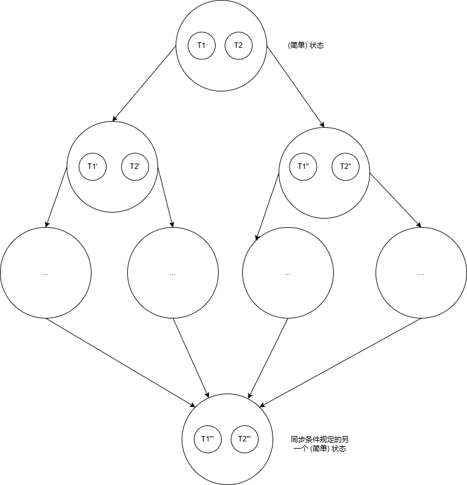
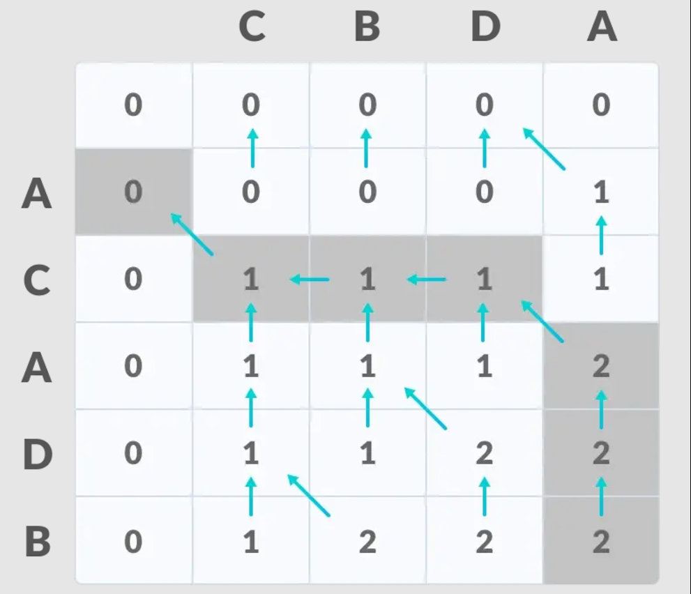
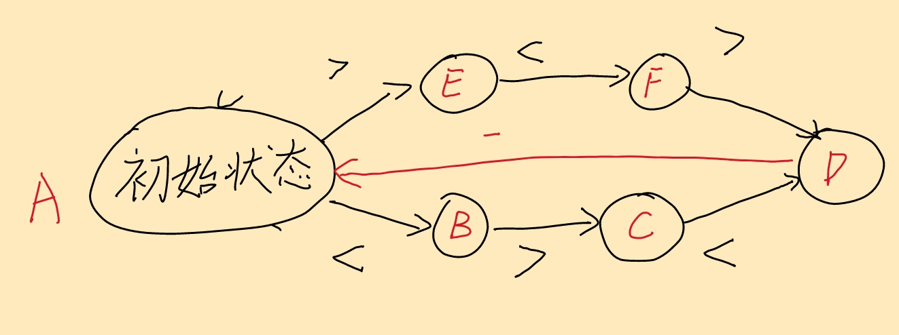

> **背景回顾**：我们已经了解如何通过 “不可优化、保证顺序” 的原子指令实现自旋锁，并在操作系统内核中借助关中断机制实现互斥。然而，互斥并不总是能满足多个并发线程协作完成任务的需求。如何能便捷地让共享内存的线程协作以共同完成计算任务？

**本讲内容**：并发控制：同步。同步问题的定义、生产者-消费者问题、“万能” 的同步方法：条件变量。

<!-- more --->

## 线程同步

> 同步 (Synchronization) : 控制并发，使得 “两个或两个以上随时间变化的量在变化过程中保持一定的相对关系”

### 现实世界中的同步

- 在某个瞬间达到 **“互相已知”** 的**统一状态**

  - NPY: 等我洗个头就出门

  - NPY: 等我打完这局游戏就来

  - 舍友：等我修好这个 bug 就吃饭

  - 导师：等我出差回来就讨论这个课题

- “先到先等”，在条件达成的瞬间再次恢复并行
  - 同时开始出去玩/吃饭/讨论

### 状态机视角下的同步

假设有若干线程处于一个 (简单) 状态, 之后它们开始并行。如果存在同步条件，无论并行时的状态迁移多么复杂，那么状态图一定会在某一时刻 "收缩" 到同步条件对应的 (简单) 状态 —— 具有同步的并行状态图本身就是一个不断 **扩张-收缩** 的过程。



### 第一个同步实现

- 线程有先后，先来先等待

```C title="自旋实现同步"
void wait_next_beat() {
retry:
    if (!next_beat_has_come) {
        goto retry;
    }
}
```

## 生产者-消费者问题与条件变量

> 生产者-消费者问题 (后文简称 P-C 问题)：存在一定数量的生产者线程与消费者线程，以及一个 **限制大小** 的 **共享缓冲区**。
>
> - 生产者线程在缓冲区未满的时候会尝试向共享缓冲区中填充内容，否则等待
> - 消费者线程会在缓冲区内存在内容时尝试从缓冲区中取出内容，否则等待
>
> 本节中我们使用 **括号嵌套** 问题来简化这一模型：
>
> ```C title="生产/消费括号"
> void produce() { printf("("); }
> void consume() { printf(")"); }
> ```

### 使用自旋来解决 P-C 问题

如果采用 **括号嵌套** 模型对 P-C 问题进行分析，那么生产者和消费者的行为可以描述成这样：

- 生产者线程在括号嵌套深度 **未达到上限** 的时候会尝试向共享缓冲区中打印左括号 (模拟生产操作)，否则等待
- 消费者线程会在 括号嵌套深度 **> 0** 的时候内存在内容时尝试从缓冲区中打印右括号 (模拟消费操作)，否则等待

那我们就可以开始照着描述实现了？

- 小心并发编程带来的各种坑!

```C title="很可能是你的第一版实现"
void produce() {
    mutex_lock(&lock);
    retry:
    // 获取当前深度的状态
    int ready = (depth < n);
    mutex_unlock(&lock);
    // 判断 持有锁的时刻内 深度是否达到上限
    if (!ready) goto retry;

    // mutex_lock(&lock);
    // assert(depth < n);
    // mutex_unlock(&lock);

    // 执行生产操作
    mutex_lock(&lock);
    depth++;
    printf("(");
    mutex_unlock(&lock);
}
void consume() {
    mutex_lock(&lock);
    retry:
    // 获取当前深度的状态
    int ready = (depth > 0);
    mutex_unlock(&lock);
    // 判断 持有锁的时刻内 深度是否不为 0
    if (!ready) goto retry;
    
    // mutex_lock(&lock);
    // assert(depth < n);
    // mutex_unlock(&lock);

    // 执行消费操作
    mutex_lock(&lock);
    depth--;
    printf(")");
    mutex_unlock(&lock);
}
```

::: important 这段代码真的是正确的吗?

你可以尝试着使用 `assert` 或者一个结果判别脚本来检验一下任意时刻括号的输出情况是否满足 `depth < n`

::: center

*请在确保你已经尝试过验证这段程序的正确性之后再继续!*

:::

```C title="改造之后的正确实现"
void T_produce() {
    while (1) {
retry:
        mutex_lock(&lk);
        if (!(depth < n)) {
            // Without this statement, what will happen?
            mutex_unlock(&lk);
            goto retry;
        }

        // The check of sync condition (depth < n) is within
        // the same critical section. As long as we safely
        // protected the shared state, this condition should
        // always hold at this point.
        assert(depth < n);

        printf("(");
        depth++;

        // And at this point, the condition (depth > 0) is
        // satisfied. However, a consumer could proceed with
        // checking depth only if the lock is released.
        mutex_unlock(&lk);
    }
}

void T_consume() {
    while (1) {
retry:
        mutex_lock(&lk);
        if (!(depth > 0)) {
            mutex_unlock(&lk);
            goto retry;
        }

        assert(depth > 0);

        printf(")");
        depth--;

        mutex_unlock(&lk);
    }
}
```

在上面这段修正后的程序中，我们把对条件的检验与线程对应的行为均放在了由同一把锁包围的 Critical Section 内，保证了 `depth` 等共享变量在判断以及执行行为的过程中不会被其余线程修改，从而保证了条件的正确性。

当然，你会发现，在同一个 P-C 问题中，执行操作前所需要判断的条件是 **通用** 的:

- 可以生产: `depth < n`
- 可以消费: `depth > 0`

我们可以用宏来代替这些条件:

```C title="也许你已经发明了条件变量"
#define CAN_PRODUCE (depth < n)
#define CAN_CONSUME (depth > 0)
```

并且，任何一个同步问题都可以使用这样的万能方法来解决：

*如果条件成立，那么 **带着锁** 执行对应的操作; 否则先暂时释放锁并等待。*

于是乎，你就发明了 **"条件变量"** (Condition Variables, CV) 这种同步机制。

### 可以不进行自旋等待吗?

在前面讲解[互斥](./mutex(2).md#正确实现互斥)的时候，我们首先采用了 **自旋** 的方式来正确实现互斥，但是自旋会 (几乎不可避免地) 导致 CPU 进入空转，非常消耗性能，因此 —— 可不可以不自旋呢？

我们在 [在用户态应用程序上实现互斥](./mutex(2).md#在用户态应用程序上实现互斥) 这一节中分析了自旋锁的缺陷，之后换用了 睡眠-切换-唤醒 这一思路来解决自旋对处理器过多空转这一问题，在同步问题上是否也能够借鉴这一思路呢？

依样画葫芦，我们可以把 **调用线程不断自旋** 这一操作改为 **使调用线程自身进入睡眠** ，使其不再占用 CPU ，提高并发效率。等到条件满足的时候，我们再把 **<u>因该条件</u>进入睡眠的线程唤醒**，也许这就大功告成了。

我们的实现也许长这样：

```C title="经过 CV 改造的 P-C 问题"
#include "thread.h" 
#include "thread-sync.h"

int n, depth = 0;
mutex_t lk = MUTEX_INIT();
cond_t cv = COND_INIT();
 
#define CAN_PRODUCE (depth < n)
#define CAN_CONSUME (depth > 0)

void T_produce() {
    while (1) {
        mutex_lock(&lk);

        if (!CAN_PRODUCE) {
            cond_wait(&cv, &lk);
            // This is subtle. Seemingly "more efficient"
            // implementation is dangerous for newbies.
        }

        printf("(");
        depth++;

        cond_signal(&cv);
        mutex_unlock(&lk);
    }
}

void T_consume() {
    while (1) {
        mutex_lock(&lk);

        if (!CAN_CONSUME) {
            cond_wait(&cv, &lk);
        }

        printf(")");
        depth--;

        cond_signal(&cv);
        mutex_unlock(&lk);
    }
}

```

::: caution

这段代码是正确的实现吗？

::: details 提示

- `signal`

- 相同的条件变量怎么能与不同的条件绑在一起呢？

如果想不清楚，可以去看 OSTEP 中的相关章节 (Chapter 29, 30) 

:::

### 更加正确的方法 —— 折中：**自旋 + 条件变量**

**条件变量的 <u>正确</u> 打开方式** ！

- 使用 `while`循环和 `broadcast`
  - **总是在唤醒后再次检查同步条件**
  - **总是唤醒所有潜在可能被唤醒的人**

```C title="自旋+条件变量的神奇组合"
mutex_lock(&mutex);
// 自旋
while (!COND) {
    // 等待条件变量
    wait(&cv, &mutex); // unlock(&mutex) + wait(&cv) + lock(&mutex)
}

// 重新检查一次条件成立
assert(cond);

// 执行相应的操作

// 广播条件变量的改变, 唤醒所有等待该条件变量的线程
cond_broadcast(&cv);

mutex_unlock(&mutex);
```

这是一种典型的 **牺牲一定效率来保证全局正确性与安全性** 的方法。

## 同步机制的运用

> 同步机制非常适用于需要等待前驱步骤完成才可执行后续步骤的情况。

### 实现任意计算图

> 计算图（Computation Graph）：被定义为有向图，其中节点对应于数学运算，计算图是表达和评估数学表达式的一种方式。而在 AI 框架中，计算图就是一个表示运算的有向无环图（Directed Acyclic Graph，DAG）。

如果计算任务构成了一个有向无环图：

- $(u, v) \in E$表示 $v$ 要用到前 $u$ 的值
- **只要调度器 (生产者) 分配任务效率够高，算法就能并行**

- 在哪些情况下无法高效分配任务呢?  !!整个算法过程中极度依赖前驱节点的内容时!!

```C++ title="分配与调度"
void T_worker() {
    while (1) {
        consume().run();
    }
}
void T_scheduler() {
    while (!jobs.empty()) {
        for (auto j : jobs.find_ready()) {
            produce(j);
        }
    }
}
```

如果要实现任意计算图，为了实现在某一步骤需要用到的数据准备完成后再开始后续步骤的执行，我们可以为每一个这类结点设置一个条件变量：

- $v$ 能执行的同步条件：$\forall (u, v) \in E,  u \rightarrow v$ 都已完成
- $u$ 完成后，signal 每个 $(u, v) \in E$

### 例子 —— DP



DP 中的状态转移方程一般都会涉及到 **前序结点** 的计算，采用数学公式表示的示例表达如下：
$$
dp_{i, j} = \left\{
    \begin{array}{rl}
      F(dp_{i, j-1}, dp_{i - 1, j}, dp_{i - 1, j - 1}) & a_i \neq b_j \\ 
      P(dp_{i, j-1}, dp_{i - 1, j}, dp_{i - 1, j - 1}) & a_i = b_j
    \end{array} \right.
$$
对于上述求最长公共子序列的算法示意图来说，我们可以把每个格子看成一个状态，状态之间组成了一个计算图。

对这些结点进行拓扑排序，你也许可以发现，随着层的深入 (假设是在上半对角线处), 可并行的部分是越来越多的:

在逐渐增加")

虽然说计算初期并行效果可能并不是那么理想，但是随着计算的深入，可并行的部分增多，计算效率会有明显的提高。

类似的情况下，**只要调度器 (生产者) 分配任务效率够高，算法就能并行**。

### 例子 —— Fish

> 我们在前面 claim 了 "99% 的并发问题都可以用 P-C 模型来解决, 100% 的并发问题都可以通过条件变量来解决"。那么下面我们来看一道不那么显然的同步问题。
>
> - 只要能搞清楚同步条件的话，同步问题就显得不那么复杂了

::: note 题目

有三种线程

- $T_a$ 若干: 死循环打印 `<`
- $T_b$ 若干: 死循环打印 `>`
- $T_c$ 若干: 死循环打印 `_`

任务：

- 对线程同步，使得屏幕打印出 `<><_` 和 `><>_` 的组合

::: details 提示

使用条件变量，只需要回答三个问题：

- 打印 “`<`” 的条件？打印 “`>`” 的条件？打印 “`_`” 的条件？

如果觉得这个问题比较难思考的话，回到我们的状态机模型吧骚年！



:::

## 总结

同步的本质是线程需要等待某件它所预期的事件发生，而事件的发生总是可以用条件 (例如 `depth` 满足某个条件，或是程序处于某个特定的状态) 来表达。因此计算机系统的设计者实现了条件变量，将条件检查和临界区 “放在一起”，以实现线程间的同步。
