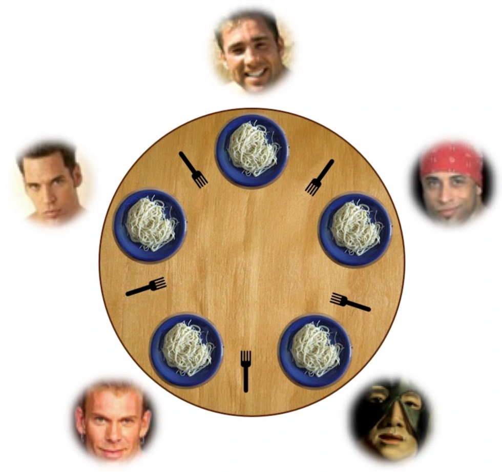
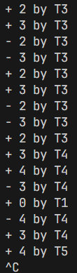

> **背景回顾**：我们分析了同步的本质需求：两个并发的线程等待某个 “同步条件” 达成，从一个 “已知的简单状态” 到达另一个 “已知的简单状态”，完成线程的同步。相应地，我们有了条件变量实现同步，并且解决了生产者-消费者问题 (括号打印问题)。

**本讲内容**：*E. W. Dijkstra* 发明的另一种共享内存系统中常用的同步方法：信号量。

## 信号量

### 使用互斥锁实现同步

::: info 一个奇妙的想法

同步是一种并发控制机制，而 **互斥** 也是一种并发控制机制，那么我们可不可以拿它来实现 **同步** 呢？

这也许是可行的：

- 互斥的时候也存在 **等待** (获取锁的时候可能出现的阻塞)
- 线程等待，锁被获取以后，线程可以 **继续执行** (达成了 **"锁被获取"这一条件** 以后继续执行)

:::

让我们抽象一下上面的想法：

- 同步条件：获取对应的锁

结合上节课中的演奏实例，你的脑子中也许会构想出类似于下面流程的 **同步** 实现:

::: details 思考过后再看噢

- 创建锁时，立即 `accquire` 它 (总是成功)
- 其他人想要获得对应的锁时就会等待，直至锁 `release`
  - 此时锁的 `release` 就实现了同步
- 一个线程上锁，在 **另一个线程** 解锁 !
  - 负责解锁的线程是同步条件的 **"主控"**
  - 然而 `pthread` 线程库并不建议这么做，因此**这仅仅是个思维实验，不建议用于正常的同步实现！**

:::

如果我们拿这种同步来实现上节课中提到的计算图，它的基本流程大致是这样：

- 为每一条边 $e=(u,v)$ 分配一个互斥锁 
- 初始时，全部处于锁定状态
- 对于一个节点，它需要获得所有 **入边** 的锁才能继续
  - 可以直接计算的节点立即开始计算
- 计算完成后，释放所有 **出边** 对应的锁

### 互斥锁实现同步的本质

对资源 (互斥锁中就是锁) 的 *release* / *acquire* 实现了 ***happens-before***

- *acquire* : 等待并获取资源 (可以将资源视为同步条件)
- *release* : 给出资源 (可以视为使同步条件达成)
- 只有给出资源了才能获取资源，必定存在这样的时序

::: tip 什么是 ***happens-before*** ?

> Author : GPT4-o

**happens-before** 是计算机科学中并发编程的一个重要概念，用于描述两个操作在时间上的因果关系。它定义了一种约束，确保一个操作的结果对另一个操作是可见的，并且没有数据竞争。这个概念最常用于多线程编程，尤其是在 Java 的内存模型（*Java Memory Model*, *JMM*）中。

如果操作 A **happens-before** 操作 B，则以下规则成立：

1. 操作 A 的结果对操作 B 是可见的。
2. 操作 A 在时间上先于操作 B（但不一定是实际的时间，而是程序执行的逻辑顺序）。

换句话说，**happens-before** 是一种用来建立执行顺序的因果关系，它解决了多线程环境下的可见性和重排序问题。

:::

现实生活中资源的 *release* / *acquire* :

- 停车场：停车位
- 游泳馆：获得手环的人可以进入更衣室
  - 使用互斥锁来充当资源似乎有什么问题？
  - !!手环真的只能有 **一个** 吗?!!

### 发明信号量

不论是我们先前所述的演奏示例、计算图问题与 ~~“更衣室”~~ 游泳馆问题，遇到的共同问题是：

- **一个** 线程需要由 **一把** 互斥锁来控制
- **一条** 边需要由 **一把** 互斥锁来控制
- **一个** 手环需要由 **一把** 互斥锁来控制
- ...

你会发现，使用互斥来实现同步的时候，资源与锁的数量比为 $1 : 1$ 。

可是游泳馆里面不可能只有一个手环...

- 使用 **互斥锁** 数组?
  - 如果手环丢了呢？

- 如果有一个可以计数的 互斥锁 就好了...

那我们就发 $n$ 个手环嘛！

- *acquire* : 获得手环的人进入更衣室 (如果没有手环了则等待)
- *release*  : 归还一个手环 (这样子就有一个正在等待的同学能够得到手环了)

> 小结：使用资源的 `acquire` / `release` 实现同步

### 把任何东西理解为 "资源"

假设一个袋子里有 $n$ 个球 :

- *Acquire*: 从袋子里取一个球
  - 如果没有球，需要等待
- *Release*: 向袋子里放一个球
  - 如果有人在等待，直接把球交给他

这个世界中可能不只有一个袋子！

### 信号量 API

如果用代码来表达我们上面提到的想法 ：

```C title="信号量API"
void P(sem_t *sem) {
    // P - prolaag
    //     try + decrease/down/wait/acquire
    // 尝试着取出球
    atomic {
        wait_until(sem->count > 0) {
            sem->count--;
        }
    }
}

void V(sem_t *sem) {
    // V - verhoog
    //     increase/up/post/signal/release
    // 放入球
    atomic {
        sem->count++;
    }
}
```

## 信号量的应用

### 信号量的两种典型应用

1. 实现一次临时的 happens-before: A→B*A*→*B*

- A→ $V(s)$ → $P(s)$ → B
  - 这就是刚才的 “互斥锁实现同步”

2. 管理计数型资源 

- 游泳池里的人不能超过 $n$ 个
- 停车场里的车不能超过 $n$ 个
- 但可以有多个 “停车场”、“游泳池”
- 我们也可以创造出车位

> 能用一个整数来表达同步条件的时候，我们就可以用信号量来实现它

### 使用信号量优雅地实现 P - C 问题

信号量设计思路

- 考虑 “球”/“手环” (每一单位的 “**资源**”) 是什么
- 生产者/消费者 = 把球从一个袋子里放到另一个袋子里

```C title="使用信号量实现 P - C 问题"
void produce() {
    P(&empty);
    printf("(");
    V(&fill);
}

void consume() {
    P(&fill);
    printf(")");
    V(&empty);
}
```

### Fish

如果我们要使用信号量进行更加复杂的同步呢？

有三种线程

- $T_a$ 若干: 死循环打印 `<`
- $T_b$ 若干: 死循环打印 `>`
- $T_c$ 若干: 死循环打印 `_`

任务：

- 对线程同步，使得屏幕打印出 `<><_` 和 `><>_` 的组合

::: info 问题分析

**一个小困难** :

- 假设刚打印完一条完整的鱼
  - `<><_` 或 `><>_`
- `<` 和 `>` 都是可行的
  - 信号量似乎不太好表达 **“多选一”**

**使用 *happens-before*** ：

- 为每个字符设置一个信号量
  - 例如，打印 `<` 的就 `P(<)`
- 维护状态机，由上一个完成的线程决定 `V` 哪一种字符

:::

## 信号量、条件变量与同步

### 信号量 VS. 条件变量

- 信号量
  - 互斥锁的自然推广
  - 干净、优雅：没有条件变量的 “自旋” (虽然条件变量也不一定要自旋)
- 条件变量
  - 万能：适用于任何同步条件
  - 不太好用：代码总感觉不太干净 (也还好其实)

### 更复杂的同步条件 —— 哲学家吃饭问题

::: info 问题描述

### 哲♂学家吃饭问题 (E. W. Dijkstra, 1960)

- 哲学家 (线程) 有时思考，有时吃饭
- 吃饭需要 **同时得到左手和右手的叉子**
- 思考时 **放下当前持有的所有叉子**



:::

我们尝试着分别使用 **条件变量** 与 **信号量** 来处理这个同步问题

#### 条件变量

先确定同步条件：**哲学家的左手叉子和右手叉子均空闲**

然后无脑上模板就对了 :white_check_mark:

#### 信号量

- *acquire* / *P* 操作 : 同时获取左右两侧的叉子
- *release* / *V* 操作 ：同时放下左右两侧的叉子

那让我们试试看？

```C title="使用信号量的尝试"
void Tphilosopher(int id) {
    int lhs = (id + N - 1) % N;
    int rhs = id % N;

    while (1) {
        // Come to table
        // P(&table);

        P(&avail[lhs]);
        printf("+ %d by T%d\n", lhs, id);
        P(&avail[rhs]);
        printf("+ %d by T%d\n", rhs, id);

        // Eat.
        // Philosophers are allowed to eat in parallel.

        printf("- %d by T%d\n", lhs, id);
        printf("- %d by T%d\n", rhs, id);
        V(&avail[lhs]);
        V(&avail[rhs]);

        // Leave table
        // V(&table);
    }
}
```

但是很不幸，程序执行了一小会就卡住了：



~~很遗憾，被评定为不通过...~~

这究竟是为什么呢？

当出现了 **五个哲学家都同时举起（持有）了一个叉子** 的情况时，整个程序就产生了 **死锁** —— 在哲学家不获取到两个叉子之前，他们是无法放下叉子的。

如果要用信号量来实现的话，我们也许要在哲学家获取叉子的策略方面下手，或者用不那么显然的方法...

#### 信号量 —— 成功尝试

从上面 **<u>唯一</u>**[^unique] 产生死锁的情况来看，或许我们只需要保证这种情况不发生就可以成功地用信号量来实现这个问题的同步了。

1. 从桌子上赶走一个人 (非常不显然的想法)

- 直观理解：大家先从桌上退出
  - 袋子里有 4 张卡
  - 拿到卡的可以上桌吃饭 (拿叉子)
  - 吃完以后把卡归还到袋子

2. Lock Ordering

- 给叉子编号，总是先拿编号小的

由上，我们可以看到，在面对复杂同步问题时，信号量就有些力不从心了 —— 数值型资源不总是能很好地代表同步条件。

### 用条件变量实现信号量

同步条件：!!`#define COND sem->count > 0`!!

```C title="用条件变量实现信号量"
void P(sem_t *sem) {
    hold(&sem->mutex) {
        while (!COND)
            cond_wait(&sem->cv, &sem->mutex);
        sem->count--;
    }
}

void V(sem_t *sem) {
    hold(&sem->mutex) {
        sem->count++;
        cond_broadcast(&sem->cv);
    }
}
```

### 用信号量实现条件变量

```C title="正确实现条件变量很困难"
void wait(struct condvar *cv, mutex_t *mutex) {
    // At this point, we hold "mutex".
    mutex_lock(&cv->lock);
    cv->nwait++;
    mutex_unlock(&cv->lock);

    // We have marked this thread as "waiting".
    // Now we release the lock and go to sleep.
    //
    // <-- broadcast() may happen here.
    //     Suppose T1 calls broadcast() and proceeds
    //     with execution. T1 may call wait() and
    //     erroneously being signaled.
    mutex_unlock(mutex);

    // <-- also, here.
    P(&cv->sleep);

    // Re-acquire the mutex.
    mutex_lock(mutex);
}

void broadcast(struct condvar *cv) {
    mutex_lock(&cv->lock);

    // Wake up all waiting threads.
    for (int i = 0; i < cv->nwait; i++) {
        V(&cv->sleep);
    }
    cv->nwait = 0;
    mutex_unlock(&cv->lock);
}
```

上面这段代码是 **错误** 的代码。如果生产者在 `broadcast` 唤醒唤醒到了生产者，这时候线程阻塞 —— 因为无法改变同步条件。

这段代码也是很难修改的：

- 先释放锁，再执行 P
  - 释放锁的一瞬间可能与 `broadcast` 并发

- 先执行 P，再释放锁
  - `P(&cv->sleep)` 会 “永久睡眠”

那该怎么办？

- 我们希望下面这三条操作是原子的，且被保护的
  - `cv->nwait++`
  - `mutex_unlock(mutex)`
  - `P(&cv->sleep)`

然而，`mutex_unlock(mutex)` + `P(&cv->sleep)` = Condition Variables！

## 总结

信号量可以看做是互斥锁的一个 “推广”，可以理解成游泳馆的手环、袋子里的球，通过计数的方式实现同步——在符合这个抽象时，使用信号量能够带来优雅的代码。但信号量不是万能的——理解线程同步的条件才是真正至关重要的。

::: details 额外小记

- 信号量是互斥锁的扩展, 当 $n = 1$ 时，信号量等价于 **互斥**

- 信号量去除了单线程 acquire/release 的限制, 因此它并不在乎 **顺序性** 。

- 信号量：**在合适的时候好用；但不总是好用**

:::

[^unique]: 如果存在有一个哲学家获取两个叉子的情况，那么他一定会放下这两个叉子，也就不可能造成死锁现象。

