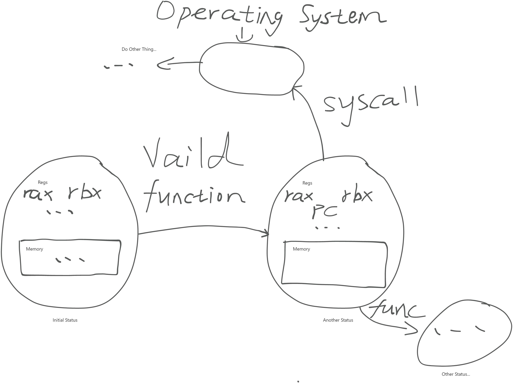
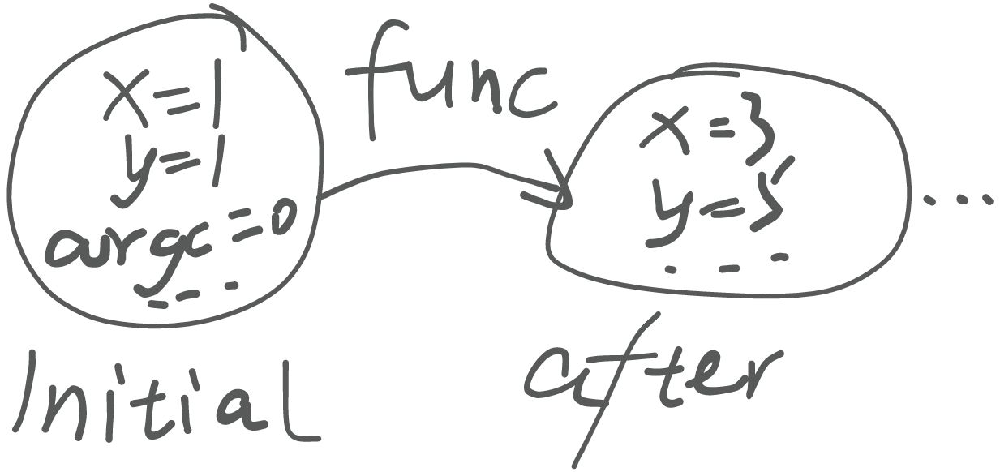

> **背景回顾**：操作系统是连接软件和硬件的桥梁。因此想要理解操作系统，我们首先需要对操作系统的服务对象 (应用程序) 有更精确和深刻的理解。

**本讲内容**：程序的状态机模型；回答以下问题：

- 什么是程序？
- 如何在操作系统上构造最小/一般、甚至是图形界面应用程序？
- 编译器的工作原理是什么？

<!-- more --->

## 程序的状态机模型

### Everything(二进制程序) is 状态机



除非产生了非法的调用(在不把状态机交给操作系统接管的前提下，也就是图中的 `syscall` 这段分支)，否则你的程序**甚至不能自行退出**！只能通过"计算"(执行指令)来使自身的状态改变至另一个状态[^状态]。

[^状态]: gdb 内可见的内存和寄存器的**某种取值情况**。

所以，不论是计算机上的 minimal 程序，还是大型的 GUI 程序，都是由**指令和系统调用**(`syscall`) 组成的！

### Everything(C 程序) is 状态机

照着 1.1 节中的 Every binary program is state machine! 这种观点，我们可以对 C 程序以类似的观点进行初步理解：

- 状态 = **变量值 + 堆栈**
- 初始状态 = **main 的第一条语句**
- 状态转移 = 后续的每一条语句中的每一小步



每一步执行后，PC 都会改变， PC 当前所处的位置**似乎**决定了状态机的状态。

但真的是这样吗？或者，PC 有可能不止一个吗？

我们来看看汉诺塔问题。在讲汉诺塔的时候，一般都把它当成递归的经典例题来讲解。初次接触递归确实会感到有点困难，因为你很难搞清楚这个问题的**状态是什么，以及状态是如何转移的。**

或许在上 C 语言的时候老师有讲过递归程序如何进行的问题，一般的解释是”把待调用的**程序段**放到堆栈中“，但是，如果只放程序段到堆栈中，在调用异常中断或者调用结束时，如何返回到原进程中呢？因此，程序的状态里面**一定包含 PC**，用来记录调用完成后该跳转到的位置。同理，如果借着上面的解释来说，需要把它修改成”把待调用的程序段的**状态**放到堆栈中“。这也就是说，PC 并不一定”只有一个“，在类似于这样的递归过程中，一般会有**多个 PC 的快照**存于堆栈中。

这种时候，你可以直观地感受到上面对于 C 程序的初步理解的局限性。现在我们可以给出一种更进一步~~真正意义上~~的”理解“：

> “状态机” 是拥有**严格数学定义**的对象。这意味着你可以把定义写出来，并且用**数学严格**的方法理解它 —— 形式化方法
>

- 状态
  - frames[StackFrame（栈帧）, StackFrame, ...] + 全局变量
- 初始状态
  - 仅有一个 StackFrame(main, argc, argv, **PC=0**)
  - 全局变量全部为初始值
- 状态迁移
  - 执行 **frames[-1].PC** 处的简单语句
    你可以尝试着根据这种理解将递归版的汉诺塔改为非递归的汉诺塔。

```c
int hanoi(int n, char from, char to, char via)
{
    if (n == 1)
    {
        printf("%c -> %c\n", from, to);
        return 1;
    }
    else
    {
        int c1 = hanoi(n - 1, from, via, to);
        hanoi(1, from, to, via);
        int c2 = hanoi(n - 1, via, to, from);
        return c1 + c2 + 1;
    }
}
```

如果有不理解的地方，可以去看看[老师提供的汉诺塔代码](https://jyywiki.cn/os-demos/introduction/hanoi/)（包含递归程序与非递归程序，递归程序已经在上面的代码块中了）。

```c
#include 
#include 

struct Frame
{
    // Each frame has a program counter to keep track its next
    // to-be-executed statement.
    int pc;

    // The internal state of the frame. This state includes
    // both arguments and local variables (if any).
    //
    // Arguments:
    int n;
    char from, to, via;

    // Local variables:
    int c1, c2;
};

typedef struct Frame Frame;

int hanoi(int n, char from, char to, char via)
{
    Frame stk[64];
    Frame *top = stk - 1;

// Function call: push a new frame (PC=0) onto the stack
#define call(...) ({ *(++top) = (Frame){.pc = 0, __VA_ARGS__}; })

// Function return: pop the top-most frame
#define ret(val) ({ top--; retval = (val); })

    // The last function-return's value. It is not obvious
    // that we only need one retval.
    int retval = 0;

    // The initial call to the recursive function
    call(n, from, to, via);

    while (1)
    {
        // Fetch the top-most frame.
        Frame *f = top;
        if (top < stk)
        {
            // No top-most frame any more; we're done.
            break;
        }

        // Jumps may change this default next pc.
        int next_pc = f->pc + 1;

        // Single step execution.

        // Extract the parameters from the current frame. (It's
        // generally a bad idea to reuse variable names in
        // practice; but we did it here for readability.)
        int n = f->n, from = f->from, to = f->to, via = f->via;

        switch (f->pc)
        {
        case 0:
            if (n == 1)
            {
                printf("%c -> %c\n", from, to);
                ret(1);
            }
            break;
        case 1:
            call(n - 1, from, via, to);
            break;
        case 2:
            f->c1 = retval;
            break;
        case 3:
            call(1, from, to, via);
            break;
        case 4:
            call(n - 1, via, to, from);
            break;
        case 5:
            f->c2 = retval;
            break;
        case 6:
            ret(f->c1 + f->c2 + 1);
            break;
        default:
            assert(0);
        }

        f->pc = next_pc;
    }

    return retval;
}
```

### 扩展——尝试将非递归汉诺塔扩展到 `f` 和 `g` 两个函数互相调用的情况

1. 先写出递归的程序
2. 再进行修改，可以仿照着给出的非递归汉诺塔程序进行编写

本节中我们采用一个有实际应用的问题来进行抽象与改写——**左右子树遍历：**

在二叉树的遍历中，`f` 可以处理左子树，`g` 可以处理右子树：

- `f`: 处理左子树，递归调用 `g` 处理右子树。
- `g`: 处理右子树，递归调用 `f` 处理左子树。

它的递归版本代码如下，统计二叉树中总的结点个数：

```c
#include 
#include 

// 定义二叉树节点结构体
struct TreeNode {
    int val;
    struct TreeNode *left;
    struct TreeNode *right;
};

// 定义函数原型
int f(struct TreeNode* node);
int g(struct TreeNode* node);

// 递归遍历左子树的函数 f
int f(struct TreeNode* node) {
    if (node == NULL) {
        return 0;
    }
    // 处理当前节点
    // printf("Visited node (f): %d\n", node->val);
    
    // 递归调用 g 处理右子树
    int c1 = g(node->right);
    
    // 递归调用 f 处理左子树
    int c2 = f(node->left);

    return c1 + c2 + 1;
}

// 递归遍历右子树的函数 g
int g(struct TreeNode* node) {
    if (node == NULL) {
        return 0;
    }
    // 处理当前节点
    // printf("Visited node (g): %d\n", node->val);
    
    // 递归调用 f 处理左子树
    int c1 = f(node->left);
    
    // 递归调用 g 处理右子树
    int c2 = g(node->right);

    return c1 + c2 + 1;
}

// 辅助函数，用于创建新节点
struct TreeNode* createNode(int val) {
    struct TreeNode* newNode = (struct TreeNode*)malloc(sizeof(struct TreeNode));
    newNode->val = val;
    newNode->left = NULL;
    newNode->right = NULL;
    return newNode;
}

int main() {
    // 构建一个简单的二叉树
    struct TreeNode* root = createNode(1);
    root->left = createNode(2);
    root->right = createNode(3);
    root->left->left = createNode(4);
    root->left->right = createNode(5);
    root->right->left = createNode(6);
    root->right->right = createNode(7);

    // 从根节点开始遍历，调用 f 函数
    printf("Total count of nodes in the binrary tree: %d", f(root));

    return 0;
}
```

先回看一下汉诺塔问题是如何从递归改写到非递归程序的，这里我们对比两段代码：

```c
// ...
// Function call: push a new frame (PC=0) onto the stack
#define call(...) ({ *(++top) = (Frame){.pc = 0, __VA_ARGS__}; })

// Function return: pop the top-most frame
#define ret(val) ({ top--; retval = (val); })

int next_pc = f->pc + 1;

switch (f->pc)
{
    case 0:
        if (n == 1)
        {
            printf("%c -> %c\n", from, to);
            ret(1);
        }
        break;
    case 1:
        call(n - 1, from, via, to);
        break;
    case 2:
        f->c1 = retval;
        break;
    case 3:
        call(1, from, to, via);
        break;
    case 4:
        call(n - 1, via, to, from);
        break;
    case 5:
        f->c2 = retval;
        break;
    case 6:
        ret(f->c1 + f->c2 + 1);
        break;
    default:
        assert(0);
}

f->pc = next_pc;
// ...
```

```c
int hanoi(int n, char from, char to, char via)
{
    // 0
    if (n == 1)
    {
        printf("%c -> %c\n", from, to);
        return 1;
    }
    else
    {
        // 1, 2
        int c1 = hanoi(n - 1, from, via, to);
        // 3
        hanoi(1, from, to, via);
        // 4, 5
        int c2 = hanoi(n - 1, via, to, from);
        // 6
        return c1 + c2 + 1;
    }
}
```

将两段代码对比起来看，是不是发现了什么？

没错，非递归版只是把递归版的每条指令拆出来，然后使用 PC 来指定当前执行哪一条指令而已。实质上也就是在**模拟**递归时堆栈上进行的操作。

下面是根据上述分析得到的非递归代码：

```c
#include 
#include 
#include 

// Binary tree node
struct TreeNode
{
    int val;
    struct TreeNode *left;
    struct TreeNode *right;
};

typedef struct TreeNode TreeNode;

TreeNode *createNode(int val)
{
    struct TreeNode *newNode = (struct TreeNode *)malloc(sizeof(struct TreeNode));
    newNode->val = val;
    newNode->left = NULL;
    newNode->right = NULL;
    return newNode;
}

// States the running state
struct StackFrame
{
    // The Program counter
    int pc;

    // The Arguments
    TreeNode *treeNode;

    // Local Variables
    int cl, cr;
};

typedef struct StackFrame Frame;

int loopCall(TreeNode *root)
{

    Frame stk[64];
    Frame *top = stk - 1;

    // Function call: push a new frame (PC=0) onto the stack
#define call(root, ...) ({ *(++top) = (Frame){.pc = 0, .treeNode = root, __VA_ARGS__}; })

// Function return: pop the top-most frame
#define ret(val) ({ top--; retval = (val); })

    // The return val
    int retval = 0;
    // The initial call
    call(root);

    while (1)
    {
        Frame *currentFrame = top;
        if (top < stk)
        {
            // Nothing to do.
            break;
        }

        int next_pc = currentFrame->pc + 1;

        switch (currentFrame->pc)
        {
        case 0:
            if (currentFrame->treeNode == NULL)
            {
                ret(0); // Not return(0)!!
            }
            break;

        case 1:
            call(currentFrame->treeNode->left);
            break;

        case 2:
            currentFrame->cl = retval;
            break;

        case 3:
            call(currentFrame->treeNode->right);
            break;

        case 4:
            currentFrame->cr = retval;
            break;

        case 5:
            ret(currentFrame->cl + currentFrame->cr + 1);
            break;

        default:
            assert(0);
        }

        currentFrame->pc = next_pc;
    }

    return retval;
}
```
