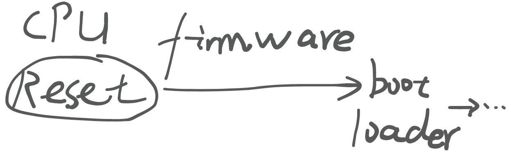
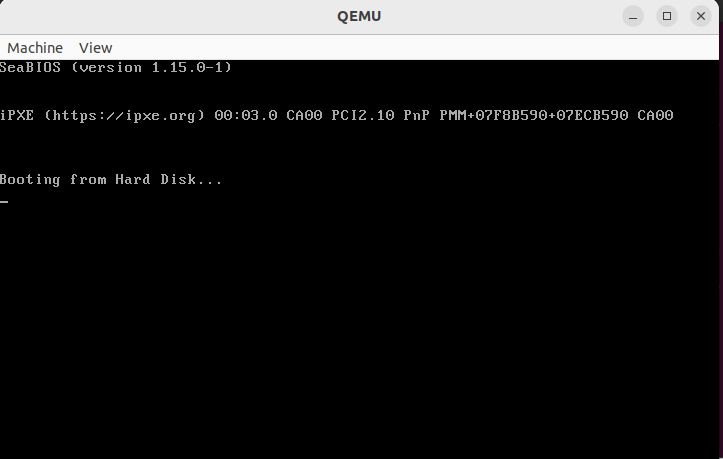

>   **背景回顾**：我们已经知道，程序可以用状态机表示，而编译器实现了 “高级语言状态机” 到 “机器指令状态机” 的翻译。但我们的程序乃至操作系统，要想运行在计算机硬件上，还有一些 “我们不知道的约定”。

**本讲内容**：计算机系统的状态机模型；回答以下问题：

-   什么是计算机 (硬件) 系统？
-   计算机硬件和程序员之间是如何约定的？
-   听说操作系统也是程序。那到底是鸡生蛋还是蛋生鸡？

<!-- more --->

## 计算机系统的状态机模型

根据绪论 2 中所抛出的 `Everything is state machine.` 这一思想，我们尝试着把计算机系统也抽象成一个状态机。

+ 状态
  + 内存、寄存器的数值
  + 这就完了？
+ 初始状态
  + 由系统设计者规定 (CPU Reset)
+ 状态迁移
  + 从 PC 取指令执行
  + 只有这一种简单操作吗？
    计算机系统具有物理态，它的状态与外部世界是有关系的，例如 I/O、中断、Reset 等**外部输入的**状态(不考虑**内部**必要的中断等)，这些都是客观存在的，但是计算机系统无法直接访问(与进程无法直接访问进程外的信息类似)。

+ 执行指令
  + 如果有多个处理器？
    + 可以想象成 “每次选一个处理器执行一条指令”
    + 在并发部分会回到这个问题
+ 中断响应
  + `if (intr) goto vec;`
+ 输入输出
  + 与 “计算机系统外” 交换数据
  + 类似于程序：不使用 `syscall` 就等于死循环 -> 不获取外部状态就等于死循环

## 固件(Firmware)



## 调试固件

在 IBM PC/PC-DOS 2.0 (1983) 时代，计算机就与程序员有了如下约定：

+ Firmware (BIOS) 会加载磁盘的前 512 字节到内存中的 `0x7c00` 位置
  + 前提：这 512 字节最后是 `0x55`, `0xAA`


(看向了手头的 QEMU)：要不试试看吧

```bash
( echo "eb fe 11 22 33 44" | xxd -r -p; \
	  cat /dev/zero | head -c 504; \
	  echo "55 aa" | xxd -r -p \
) > minimal.img

# run the provided Makefile
make 
```




然后我们尝试着把最后 2 Byte 的内容修改一下：


**如果 Firmware 也是一段代码？**

计算机系统从 `CPU Reset` 开始：

+ `CPU Reset` 的时候，`0x7c00` 应该是啥也没有的
+ Firmware 的代码扫描了磁盘、加载了它
那么照理来说，我们或许可以看到 Firmware 加载磁盘字节的过程，换句话说，我们应该能够看到 Firmware 中的哪条指令对 `0x7c00` 位置上的数据进行了修改。
那你自然而然就能想到我们的老朋友 Debugger —— `gdb`。通过在 `0x7c00` 这一观察点上设置[监视点(Watchpoint)](https://sourceware.org/gdb/current/onlinedocs/gdb.html/Set-Watchpoints.html) 与 Breakpoint，我们就能够调试并且观察到哪条指令对 `0x7c00` 位置上的内容进行了修改。

> 监视点：当被设置监视点的位置上的值被修改时，程序会暂停运行。结合 PC 指针即可获取到此前正在执行的指令。
>

然而，每次调试都需要在 `0x7c00` 处添加监视点和断点，如果你手滑退出去了，又需要重新设置断点后调试，这也太烦人了。

所以，我们可以针对不同的调试需求预先定义 `gdb` 调试的相关设置，详见 `debug-firmware` 中的 `init.gdb` 文件内容与 `debug-bootloader` 中的 `debug.py` 脚本。

Extra：About -s and -S in qemu commandsIn the command qemu-system-x86_64 -s -S $< &, the options -s and -S serve the following purposes:-s (Shorthand for setting up GDB server):This option tells QEMU to start a GDB server(That's why we need to connect to the remote in init.gdb) on port 1234. This allows you to connect a GDB debugger to the QEMU instance for debugging purposes.It is often used for debugging, enabling you to inspect the virtual machine's execution through a debugger like GDB.-S (Start execution in a stopped state):This option tells QEMU to start the virtual machine but keep the CPU in a paused (stopped) state. The execution won't start until you explicitly resume it, for example, using GDB commands.This is useful when you want to set breakpoints or examine the state of the system before running any code.Together, these options allow for powerful debugging capabilities where QEMU starts but waits for GDB to connect and control the execution flow of the virtual machine.

## Makefile 的正确打开方式
>
> Every Makefile is a state machine -> It just runs instructions.
>

因此，我们可以像先前观察 C 程序一样去观察状态机本身以及状态机的执行情况。

```bash
make -nB

# An example
make -nB \
  | grep -ve '^\(\#\|echo\|mkdir\|make\)' \ # filter
  | sed "s#$AM_HOME#\$AM_HOME#g" \ # easy to read
  | sed "s#$PWD#.#g" \
  | vim -
```

## Take-away Messages

计算机系统是严格的数学对象：没有魔法;计算机系统的一切行为都是可观测、可理解的。

+ 处理器是无情的执行指令的机器。
+ 处理器会规定好 `Reset` 后的行为。
+ `Reset` 后 Firmware 开始运行，再加载操作系统(bootloader)。
+ 厂商逐渐形成了达成共识的 Firmware Specification (IBM PC “兼容机”、UEFI、……)。
