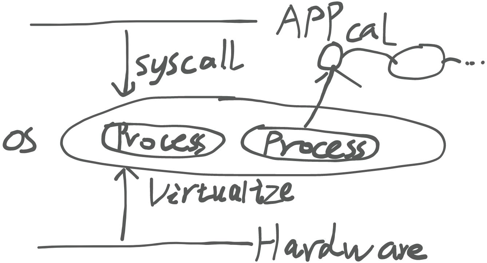
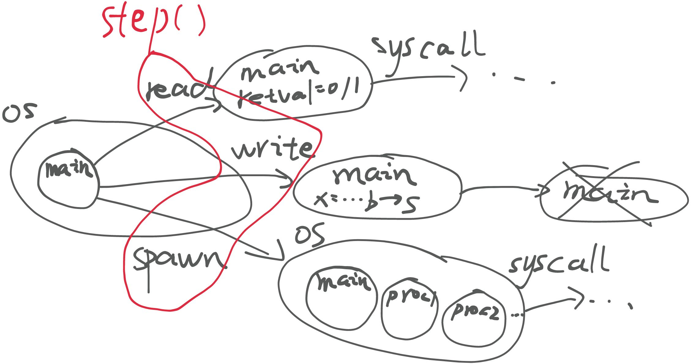

> **背景回顾**：在理解了 “软件 (应用)” 和 “硬件 (计算机)” 之后，操作系统就是直接运行在计算机硬件上的程序，它提供了应用程序执行的支撑和一组 API (系统调用)：操作系统内核被加载后，拥有完整计算机的控制权限，包括中断和 I/O 设备，因此可以构造出多个应用程序同时执行的 “假象”。

**本讲内容**：一个 Python “操作系统玩具” 的设计与实现，帮助大家在更高的 “抽象层次” 上理解操作系统的行为。这个 “玩具” 将贯穿整个课程。

<!-- more --->

## 程序正确性证明

### 程序的数学严格性

根据 `Everything is a state machine.` 这一思想，程序其实是一种**数学严格**的对象(因为状态机也是**数学严格**的)。

> 程序 = 状态 = 初始状态 + 状态迁移 (详见[绪论 2](https://www.yuque.com/yuqueyonghukaqxkk/self_learning_route/zbhox7nphbbk7kzo#YgbtA))
>

在这个视角下，程序和数学对象已经十分接近了：

$f(s) = s^{'}$

那我们可以用证明数学性质的方式，来证明程序的正确性吗？

例如某蓝色修改器，程序中存在一个 `Account` 类，表示用户的账户相关内容。

+ 成员变量
  + `b` ：Balance，表示账户余额
+ 成员方法
  + `deposit` 存款
  + `withdraw` 取款
  + `transfer` 转账

我们希望程序在执行过程中，每个账户的余额 `b` 始终保持$ b \geq 0 $。

有什么办法能够证明程序的正确性呢？

+ 暴力破解，遍历所有状态机组成的图
+ 使用数学方法，证明 $For \hspace{5pt} all \hspace{5pt} f-reachable\hspace{5pt} states, \hspace{5pt} b \geq 0  \hspace{5pt} holds$。

### 一些启发

#### 暴力枚举带来的启发

+ 我们应该把需要证明的性质写成 `assertions`
+ `assert(u->prev->next == u)` (双向链表)
  + 至少可以避免 “悄悄出错” 的情况发生

#### 写出证明带来的启发

+ 容易**阅读** (self-explain) 的代码是好代码
  + 能把代码和需求联系起来
+ 容易**验证** (self-evident) 的代码是好代码
  + 能把代码和正确性证明联系起来
  + “Proof-carrying code”

## 为操作系统建模



我们都说程序是运行在操作系统上的，既然程序是状态机，那么自然 OS 就是这些**状态机的管理者**。OS 在每一段时间内选择一个程序执行，更新该状态机的状态。但是 OS 本身也是个程序，它本身也是个状态机。

我们能否为操作系统做一个简单的建模？

### 玩具操作系统

为了方便，我们在建模过程中将 OS 简单化，将它所做的事情仅局限于：

+ 管理状态机
+ 执行系统调用

玩具操作系统中所要包含的对象：

+ 状态机(程序)
  + 可以执行计算与发出系统调用请求
+ 所有进程间共享的全局 buffer

我们这个玩具操作系统中所包含的系统调用：

+ `read()`：读入随机的 1bit
+ `write()`：将内容追加至 buffer 中
+ `spawn(proc)`：生成进程 `proc` ，并交由 OS 管理

实现的难点：

+ 多状态机切换
  + 可以借助于 Python 中的 Generator 特性来单步执行内容并保存上下文

### 实现玩具操作系统

+ 操作系统需要什么？
  + 进程列表(实现进程管理与切换)
  + 提供系统调用(供进程使用)
  + **全局** buffer(供进程输出信息)

```python
#!/usr/bin/env python3

import sys
import random
from pathlib import Path

class OS:
    '''
    A minimal executable operating system model. Processes
    are state machines (Python generators) that can be paused
    or continued with local states being saved.
    '''

    '''
    We implement three system calls:

    - read: read a random bit value.
    - write: write a string to the buffer.
    - spawn: create a new state machine (process).
    '''
    SYSCALLS = ['read', 'write', 'spawn']

    class Process:
        '''
        A "freezed" state machine. The state (local variables,
        program counters, etc.) are stored in the generator
        object.
        '''

        def __init__(self, func: function, *args):
            # func should be a generator function. Calling
            # func(*args) returns a generator object.
            self._func = func(*args)

            # This return value is set by the OS's main loop.
            self.retval = None

        def step(self):
            '''
            Resume the process with OS-written return value,
            until the next system call is issued.
            '''
            syscall, args, *_ = self._func.send(self.retval)
            self.retval = None
            return syscall, args

    def __init__(self, src):
        # This is a hack: we directly execute the source
        # in the current Python runtime--and main is thus
        # available for calling.
        exec(src, globals())
        # The "main" fuction is in the files of the given args(e.g. hello.py)
        self.procs = [OS.Process(main)]
        self.buffer = ''

    def run(self):
        # Real operating systems waste all CPU cycles
        # (efficiently, by putting the CPU into sleep) when
        # there is no running process at the moment. Our model
        # terminates if there is nothing to run.
        while self.procs:

            # There is also a pointer to the "current" process
            # in today's operating systems.
            # dispatch
            current = random.choice(self.procs)

            # syscall
            try:
                # Operating systems handle interrupt and system
                # calls, and "assign" CPU to a process.
                # contexts changing?
                match current.step():
                    case 'read', _:
                        current.retval = random.choice([0, 1])
                    case 'write', s:
                        self.buffer += s
                    case 'spawn', (fn: function, *args):
                        self.procs += [OS.Process(fn, *args)]
                    case _:
                        assert 0

            except StopIteration:
                # The generator object terminates.
                self.procs.remove(current)

        return self.buffer

if __name__ == '__main__':
    if len(sys.argv) < 2:
        print(f'Usage: {sys.argv[0]} file')
        exit(1)

    src = Path(sys.argv[1]).read_text()

    # Hack: patch sys_read(...) -> yield "sys_read", (...)
    for syscall in OS.SYSCALLS:
        src = src.replace(f'sys_{syscall}',
                          f'yield "{syscall}", ')

    stdout = OS(src).run()
    print(stdout)
```

可以对这个玩具操作系统对应的状态机进行分析：

+ 初始状态：仅一个初始进程 `main` 
+ 状态转移：随机选择一个进程执行一步 `step()`

那么它对应的状态图大致是这样的：



