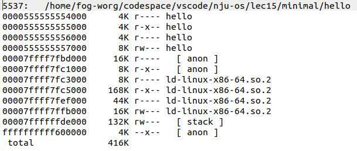
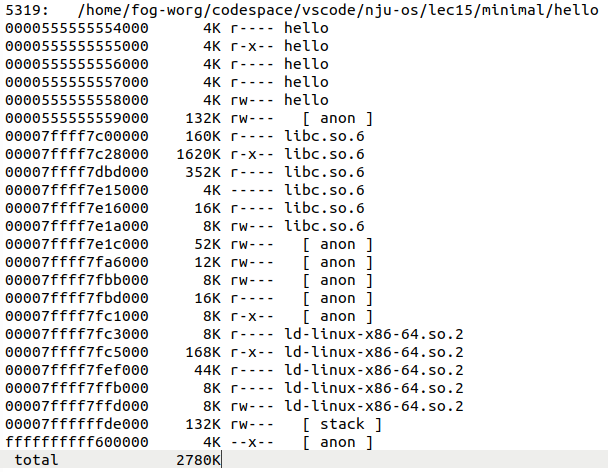
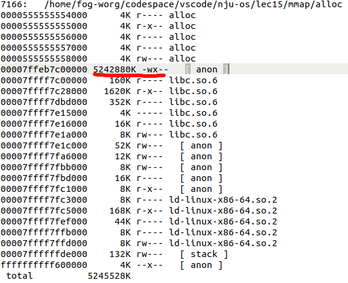
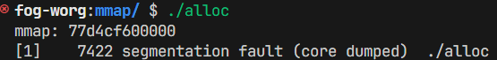
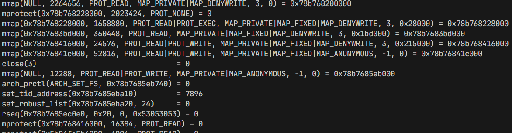

> **背景回顾**：Linux 从一个初始的程序 (状态机) 开始，构建出了整个应用程序世界——通过 fork, execve, exit，我们可以在操作系统中创建出很多并发/并行执行的程序。

**本讲内容**：在我们的状态机模型中，进程的状态由内存和寄存器组成。寄存器是非常明确的，gdb 中 `info registers` 即可查看。但进程 “平坦” 的地址空间 ($0 ... 2^{64} - 1$) 里到底有什么，以及我们是否可以 “入侵” 另一个进程的地址空间？

<!-- more --->

## 进程的地址空间

在状态机视角下，我们能够很自然的说出：

- 进程(程序) = 内存 + 寄存器
  - 寄存器简单，直接在 `gdb` 中使用 `info registers` 就可以查看到当前寄存器的状态
  - 但是内存呢？并且，到底什么是 **"进程的内存"** ？

我们总是可以将指针赋值为任意一个整数，从而让指针指向对应的地址空间。

```C title="指针赋值"
int* a = (int*) main + 0x10;
```

然后在 C 程序的意义上，我们可以对这个指针进行解引用，从而操作对应的地址空间 (当然，是否被拒绝我们暂时先不管，至少在编程的意义上我们可以这么做)。

```C title="指针解引用"
// Would these operation be legal?
printf("%d\n", *a); // load
*a = 0x100; // store
```

也许这些操作能够成功，也许会使得程序崩溃 **(几率更大)**。

这给了我们一个信息 —— **有些地址是可以读的，有些地址是可以写的，有些地址是既不能读又不能写的**...

那么我们该如何找到相对应的地址空间呢？

### ATFAI —— 如何查看 Linux 上某个进程的地址空间?

> Author: GPT-4o

在 Linux 上，可以通过查看 `/proc` 目录中的特定文件来了解某一进程的地址空间。每个运行中的进程都有一个对应的目录 `/proc/[pid]`，其中 `[pid]` 是进程的 PID (进程 ID)，该目录下包含了关于进程的各种信息。

查看进程地址空间的步骤：

1. **找到进程的 PID**： 如果你已经知道进程的 PID，可以直接跳到下一步。否则，可以使用 `ps` 或 `pgrep` 等命令来查找 PID。例如，假设你想查看名为 `my_program` 的进程：

   ```bash
   pgrep my_program
   ```

2. **查看 `/proc/[pid]/maps` 文件**： `/proc/[pid]/maps` 文件列出了进程的内存映射信息，显示了进程如何分配其地址空间。每个条目包含一个内存区域的起始和结束地址、权限、映射的文件等。

   假设你要查看进程 PID 为 `1234` 的地址空间，可以运行以下命令：

   ```bash
   cat /proc/1234/maps
   ```

   你会看到类似以下的输出：

   ```less
   00400000-00452000 r-xp 00000000 08:01 1234567 /path/to/program
   00651000-00652000 r--p 00051000 08:01 1234567 /path/to/program
   00652000-00653000 rw-p 00052000 08:01 1234567 /path/to/program
   7f9e00000000-7f9e00200000 rw-p 00000000 00:00 0 
   ...
   ```

   - 每行表示一个内存映射区域。
   - 第一列是地址范围，例如 `00400000-00452000` 表示这个区域从 `0x00400000` 到 `0x00452000`。
   - 第二列是权限标志，例如 `r-xp` 表示可读、可执行、私有映射。
   - 第三列是偏移量。
   - 第四列是设备号。
   - 第五列是 `inode` 编号。
   - 第六列是映射的文件路径，如果这个区域映射了某个文件的话。

3. **查看 `/proc/[pid]/maps` 文件中的特定区域**：

   - `r` 表示可读（read）。
   - `w` 表示可写（write）。
   - `x` 表示可执行（execute）。
   - `p` 表示私有（private），即写时复制（copy-on-write）。

根据这些信息，你可以了解进程的不同内存区域，如代码段、堆栈、堆、共享库、映射文件等。


示例输出解释：

以下是一个 `maps` 文件的简化示例：

```less
00400000-00452000 r-xp 00000000 08:01 1234567 /path/to/program
00651000-00652000 r--p 00051000 08:01 1234567 /path/to/program
00652000-00653000 rw-p 00052000 08:01 1234567 /path/to/program
7f9e00000000-7f9e00200000 rw-p 00000000 00:00 0 
7f9e00000000-7f9e00200000 rw-p 00000000 00:00 0 
...
```

- `00400000-00452000 r-xp`：该区域是程序的代码段，包含只读且可执行的代码。
- `00651000-00652000 r--p`：该区域是只读的数据段。
- `7f9e00000000-7f9e00200000 rw-p`：该区域是堆栈或动态分配的内存区域。

查看进程的完整内存映射（包括共享库、堆栈等）：

要获得进程地址空间的详细信息，包括共享库、堆、栈等，你可以使用以下命令：

```bash
cat /proc/[pid]/maps
```

或者用 `less` 等分页工具查看：

```bash
less /proc/[pid]/maps
```

其他相关信息：

- **`/proc/[pid]/smaps`**：如果你需要更详细的内存使用情况（例如，每个区域的实际物理内存使用情况），可以查看 `smaps` 文件：

  ```bash
  cat /proc/[pid]/smaps
  ```

`smaps` 提供了每个内存区域的详细统计信息，包括物理内存的使用、共享内存等。

总结：

- 使用 `/proc/[pid]/maps` 可以查看进程的内存映射，帮助你了解进程如何分配和使用内存空间。
- 对于更详细的内存使用情况，查看 `/proc/[pid]/smaps`。

通过这些方法，你可以全面了解某个进程的地址空间。

### 进程的地址空间 —— 全貌

在执行了 `cat /proc/[pid]/maps` 命令或者 `pmap` 命令来查看指定进程的地址空间信息之后，我们可以看到该进程的当前已分配内存映射段的总览：

```less
// maps file ver.
6096e05ef000-6096e0606000 r--p 00000000 08:03 3058736                    /usr/bin/zsh
6096e0606000-6096e06c4000 r-xp 00017000 08:03 3058736                    /usr/bin/zsh
6096e06c4000-6096e06df000 r--p 000d5000 08:03 3058736                    /usr/bin/zsh
6096e06df000-6096e06e1000 r--p 000ef000 08:03 3058736                    /usr/bin/zsh
6096e06e1000-6096e06e7000 rw-p 000f1000 08:03 3058736                    /usr/bin/zsh
6096e06e7000-6096e06fb000 rw-p 00000000 00:00 0 
6096e1a10000-6096e1cd0000 rw-p 00000000 00:00 0                          [heap]
// hidden lines...
7fff0ef46000-7fff0efa0000 rw-p 00000000 00:00 0                          [stack]
7fff0efda000-7fff0efde000 r--p 00000000 00:00 0                          [vvar]
7fff0efde000-7fff0efe0000 r-xp 00000000 00:00 0                          [vdso]
// negtive number?
ffffffffff600000-ffffffffff601000 --xp 00000000 00:00 0                  [vsyscall]

// pmap command ver.
1995:   /usr/bin/zsh -i
00005b3a1db21000     92K r---- zsh
00005b3a1db38000    760K r-x-- zsh
00005b3a1dbf6000    108K r---- zsh
00005b3a1dc11000      8K r---- zsh
00005b3a1dc13000     24K rw--- zsh
00005b3a1dc19000     80K rw---   [ anon ]
00005b3a1f7f0000   2076K rw---   [ anon ]
// hidden lines...
0000700364d23000     24K rw---   [ anon ]
00007ffeae233000    292K rw---   [ stack ]
00007ffeae36f000     16K r----   [ anon ]
00007ffeae373000      8K r-x--   [ anon ]
// negtive number?
ffffffffff600000      4K --x--   [ anon ]
 total            19872K
```

> 各列的介绍见上方 ChatGPT 提供的解释。

正如我们猜想的一样，各段地址空间存在不同的权限。

同时，你可能注意到有一些特殊的地址空间，让我们看看 GPT 是怎么回答的。

::: info 特定区域的作用

> Author: GPT-4o

当你查看 `/proc/<pid>/maps` 文件时，看到的这些内存区域代表了进程的虚拟地址空间的不同部分。每个区域都有不同的权限和用途。我们可以逐个分析你提供的几个区域：

1. **[heap] 区域**

```less
6096e1a10000-6096e1cd0000 rw-p 00000000 00:00 0                          [heap]
```

- **地址范围**：`6096e1a10000` 到 `6096e1cd0000`
- **权限**：`rw-p`，意味着这个区域是 **读写** 权限的，且是 **私有的**（`p` 表示 private）。
- **用途**：该区域是程序的堆内存区域（`[heap]`）。堆用于动态内存分配（例如 `malloc()`）。当程序运行时，这个区域会根据需要动态扩展。

2. **[stack] 区域**

```less
7fff0ef46000-7fff0efa0000 rw-p 00000000 00:00 0                          [stack]
```

- **地址范围**：`7fff0ef46000` 到 `7fff0efa0000`
- **权限**：`rw-p`，同样是 **读写** 且 **私有** 的权限。
- **用途**：这个区域是 **栈** 内存（`[stack]`），用于存储局部变量、函数调用信息和返回地址等。栈的大小通常在程序启动时确定，并且会随着函数调用的深度而增长或缩小。

3. **[vvar] 区域**

```less
7fff0efda000-7fff0efde000 r--p 00000000 00:00 0                          [vvar]
```

- **地址范围**：`7fff0efda000` 到 `7fff0efde000`
- **权限**：`r--p`，表示只读且私有。
- **用途**：这个区域是 **vvar**（virtual variable）内存区域。它存储了操作系统为了系统调用（如 `gettimeofday()`）而维护的 **共享** 数据 (将操作系统里面的 (只读) 数据通过内存共享给进程，使系统调用无需陷入内核中，提高效率) 。这个区域通常用于实现一些 **内核和用户空间** 共享的变量。

4. **[vdso] 区域**

```less
7fff0efde000-7fff0efe0000 r-xp 00000000 00:00 0                          [vdso]
```

- **地址范围**：`7fff0efde000` 到 `7fff0efe0000`
- **权限**：`r-xp`，表示 **只读** 和 **可执行** 权限，且是私有的。
- **用途**：这个区域是 **vdso**（virtual dynamic shared object）内存区域。它存储一些操作系统提供的函数，这些函数通常是用于实现系统调用的包装器。由于这些函数是 **预加载** 到用户空间的，因此访问这些函数的速度更快，避免了频繁的上下文切换到内核空间。

5. **[vsyscall] 区域**

```less
ffffffffff600000-ffffffffff601000 --xp 00000000 00:00 0                  [vsyscall]
```

- **地址范围**：`ffffffffff600000` 到 `ffffffffff601000`
- **权限**：`--xp`，表示 **不可读不可写**，但是是 **可执行** 且 **私有** 的。
- **用途**：这是 **vsyscall**（virtual system call）区域。与 `vdso` 类似，`vsyscall` 是操作系统为提高系统调用效率而设立的特殊内存区域。系统调用（例如 `getpid()`）可以通过直接跳转到 `vsyscall` 区域来执行，而 **不需要进入内核模式**。`vsyscall` 主要在较旧的 Linux 系统上使用，在较新的系统中，它已经被 `vdso` 所取代。

6. 关于负数的符号问题

你提到的 "负数" 是指以下这行：

```less
ffffffffff600000-ffffffffff601000 --xp 00000000 00:00 0                  [vsyscall]
```

这个 `ffffffffff600000` 地址范围看起来像是“负数”，但其实它是一个 **高位地址**，在 64 位系统中，虚拟地址空间的 **高端是为内核空间保留的，而低端则用于用户空间**。因为 64 位系统支持非常大的地址空间，它将地址空间划分为多个部分：

- **内核空间**：从 `0xffff800000000000` 到 `0xffffffffffffffff`（这些地址通常用于内核和硬件映射等）。
- **用户空间**：从 `0x0000000000000000` 到 `0x7fffffffffffffff`（这些地址是应用程序的虚拟地址空间）。
- ??? : 从 `0x7fffffffffffffff` 到 `0xffff800000000000` 这段区域是拿来干什么的呢？

在 `/proc/<pid>/maps` 中显示的这些高地址（如 `ffffffffff600000`）**实际上是内核空间的一部分**，但它们仍然在进程的虚拟地址空间中列出，以便能查看到内核级的资源（如 `vsyscall`）。

7. 总结

- **堆 (`[heap]`)** 和 **栈 (`[stack]`)** 区域是进程的内存分配区域，分别用于动态内存和局部变量。
- **`[vvar]`** 和 **`[vdso]`** 区域与操作系统提供的系统调用包装函数和共享变量相关。
- **`[vsyscall]`** 区域曾用于提高系统调用的效率，现代系统中可能已被 `vdso` 取代。
- 高地址范围（如 `ffffffffff600000`）并不是负数，而是 **内核空间** 的虚拟地址区域。

这些内存区域的分配和权限设置帮助操作系统有效地管理进程的内存。

:::

### :hot_pepper: 系统调用 —— 一定需要 `syscall` 吗？

详见 [Do we always need `syscall` ?](./do-we-always-need-syscall.md)

### 管理进程的地址空间

还是从状态机的视角来看：

- 地址空间 = 带 **访问权限** 的内存段
  - 不存在 (不可访问)
  - 不存在 (可读/写/执行)
- 管理 = **增加/删除/修改一段可访问的内存**

我们可以使用 `gdb` 调试一下程序，查看一下程序内的地址空间分配情况:

1. `gdb [OPTIONS] FILE_NAME` 开始使用 `gdb` 进行调试

2. `starti` 执行完起始的第一条语句后暂停执行

3. `info proc mappings` 查看进程的 `maps` 文件信息

4. `info inferiors` 查看当前正在被 `gdb` 调试的进程信息

   > "Inferior" is a general term to mean "something that you are using gdb to debug"

5. `!pmap [pid]` 查看 (更加) 人类可读的地址空间分配信息

我们随意测试了一个程序，在执行 `malloc` 前后查看了一下进程对应的地址空间信息：(结果不在同一次调试中呈现，因此进程号不相同)

```C title="hello.c"
int main() {
    printf("Hello World\n");
    int* mem = (int*) malloc(1000000 * 8LL);
    printf("We've allocated memory!\n");
    free(mem);
}
```






我们发现进程当前持有的地址空间总数 **变大** 了。那么一定存在一种机制，能够动态修改进程的地址空间映射。

::: info :thinking:

究竟是哪种 (些) 指令能够动态修改这类信息呢？

:::

答案自然是我们的 `syscall` 了。`mov`、`ret` 等基本指令(至少在用户态进程中，暂时没求证过的话不能说太死)完全不可能修改这些信息。那么又是哪种系统调用能够完成这件事情呢？

### `mmap` (Memory Map) 系统调用

> 详细手册可使用 `man 2 mmap` 查看。

Linux 中为我们提供了 `mmap` 这一系统调用来对进程地址空间映射数据做增删改操作。

行为简要描述：在状态机状态上增加/删除/修改一段可访问的内存

- `MAP_ANONYMOUS`: 匿名 (申请) 内存
- `fd`: 把文件 “搬到” 进程地址空间中 (例子：加载器)
- 更多的行为请参考手册 (复杂性暴增)

```C title="mmap API"
// 映射
void *mmap(void *addr, size_t length, int prot, int flags,
           int fd, off_t offset);
int munmap(void *addr, size_t length);

// 修改映射权限
int mprotect(void *addr, size_t length, int prot);
```

::: warning 个人遇到的一些小插曲

在参考手册自行玩一玩示例程序的过程中，似乎出现了一些小问题：

```C title="示例程序"
#include <unistd.h>
#include <stdint.h>
#include <stdio.h>
#include <stdlib.h>
#include <sys/mman.h>

#define GiB * (1024LL * 1024 * 1024)

int main() {
    volatile uint8_t *p = mmap(
        NULL,
        5 GiB,
        PROT_WRITE | PROT_EXEC, // 没有设置读权限
        MAP_ANONYMOUS | MAP_PRIVATE, // 设置匿名与私有属性
        -1, 0
    );

    printf("mmap: %lx\n", (uintptr_t)p);

    if ((intptr_t)p == -1) {
        perror("cannot map");
        exit(1);
    }

    *(p + 4 GiB) = 1;
    *(p + 2 GiB) = 2;
    *(p + 3 GiB) = 3;
    printf("Read get: %d\n", *(p + 4 GiB));
    printf("Read get: %d\n", *(p + 2 GiB));
    printf("Read get: %d\n", *(p + 3 GiB));
}
```

```less title="执行结果"
mmap: 77354ea00000
Read get: 1
Read get: 2
Read get: 3
```

:scream: 为什么不设置读权限程序也能正常运行，而不是遇到 *Segmentation Fault* 呢？

首先我使用 `gdb` 调试了一下：



这块 5 GiB 内存段的权限设置并没有任何问题。

然后我试着把权限设置为了 `PROT_NONE`, 没有任意权限，很自然地崩溃了。



同理，`PROT_EXEC` 也不行。最后就到了 `PROT_WRITE` ，结果发现 **只需要设置写权限** 就能够正常运行。

::: center

~~可能主要和 **内存保护模型** 以及 **执行权限的特殊处理** 有关，ATFAI, RTFM, RTFW 任君挑选~~

:::

#### Example 1: 申请大量内存空间

- 瞬间完成内存分配
  - `mmap`/`munmap` 为 `malloc`/`free` 提供了机制
  - `libc` 的大 `malloc` 会直接调用一次 `mmap` 实现
- 不妨 `strace`/`gdb` 看一下
  

#### Example 2: Everything is a file

- 映射大文件、只访问其中的一小部分

```python title="检查大文件的前512字节"
with open('/dev/sda', 'rb') as fp:
    mm = mmap.mmap(fp.fileno(),
                   prot=mmap.PROT_READ, length=128 << 30)
    hexdump.hexdump(mm[:512])
```

## "入侵" 进程的地址空间

::: info 回顾：状态机模型

**进程 (状态机) 在 “无情执行指令的机器” 上执行** :

- 状态机是一个 **封闭世界** (基本假设)
- 但如果 **允许一个进程对其他进程的地址空间有访问权** ？(打破基本假设)
  - 意味着可以任意改变另一个程序的行为
    - 听起来就很 cool

:::

**一些 “入侵” 进程地址空间的例子**:

- 调试器 (`gdb`)
  - `gdb` 可以任意观测和修改程序的状态
    - 将被调试进程的信息搬到自己的地址空间内
- *Profiler* (`perf`)
  - [M3](https://jyywiki.cn/OS/2024/labs/M3.md) 中借助它理解程序的性能瓶颈

不知道你是否用过一些游戏修改器，例如 Cheat Engine、八门神器、葫芦侠修改器、烧饼修改器等等。实际上游戏修改器也是通过入侵游戏进程的地址空间来实现修改的。

::: tip 修改游戏中的金钱

假如说我们想要修改游戏进程中的金钱数，应该怎么做？

- 在 **允许一个进程对其他进程的地址空间有访问权** 的情况下，我们可以扫描游戏进程的地址空间
- 看看有没有值 = 待查找值的地址
- 如果找到了 **比较少** 的地址，进行修改；否则就尝试着 **缩小范围**
  - 怎么缩小范围呢？
    - 观察状态机的状态改变轨迹就可以了！

:::

实际上我们在使用游戏修改器的时候，就是使用了 **查找 + Filter** 的方式来找到待修改的地址的！

- 进入游戏时 $exp = 4950$
- 打了个怪 $exp = 5100$
- 符合 $4950 \rightarrow 5100$ 变化的内存地址是很少的
  - 好了，出门就是满级了

## 改变进程对时间的感知

**程序 = 状态机** :

- “计算指令” 是不能感知时间的
  - *spin count* 计时会出现 “机器变快，游戏没法玩” 的情况
  - **`syscall` 是感知时间的唯一方法**

所以如果要改变进程对时间的认知，我们可以 **“劫持” 和时间相关的 `syscall`/库函数**

- 改变程序对时间的认知
- 就像手表调快/慢了一样

比如下面的例子就劫持了程序中的 `gettimeofday` 这一与事件相关的函数。

```python title="使用gdb实现对时间的hack"
import gdb
import datetime

ratio = float(gdb.parse_and_eval('$gear_ratio'))

# Get the current time
start = datetime.datetime.now()

def hacked_time():
    now = datetime.datetime.now()
    
    # The speed of the clock is adjusted
    t = start + (now - start) * ratio

    tv_sec = int(t.timestamp())
    tv_usec = t.microsecond
    return (tv_sec, tv_usec)

class SetTimevalBreakpoint(gdb.Breakpoint):
    def __init__(self):
        # 在 gettimeofday 处打断点
        super(SetTimevalBreakpoint, self).__init__(
            'gettimeofday',
            gdb.BP_BREAKPOINT,
            internal=False
        )

    def stop(self):
        # 计算 变速之后的时间
        tv_sec, tv_usec = hacked_time()

        # core implementation: Replace the function body
        gdb.execute(
            'set *(struct timeval *)($rdi) = {{ {}, {} }}'
                .format(tv_sec, tv_usec)
        )
        gdb.execute('set $rax = 0')
        gdb.execute('return')

        return False  # Continue execution

SetTimevalBreakpoint()
gdb.execute('run')
```

> 在上面的代码中，我们使用了 "钩子函数" (*hook function*) 来钩住函数的执行，然后就可以 "劫持" 相关的代码了...

我们其实可以认为 “劫持代码” 的本质是 *debugger* 行为

- 游戏也是程序，也是状态机
- 外挂就是 “为这个游戏专门设计的 `gdb`”

## 总结

状态机的视角自然地将我们引入 “内存到底是什么” 的问题——它的答案同样也很自然：带有 **访问权限** 控制的连续 **内存段** 。我们可以通过 `mmap`、`munmap`、`mprotect` 三个系统调用调整状态机的地址空间，包括分配匿名的内存、映射文件内容到内存、修改访问权限等。更有趣的是操作系统有 “能够实现一切应用程序” 的需求，调试器也不在话下——这也给了我们 "入侵" 其他进程地址空间的机制。

