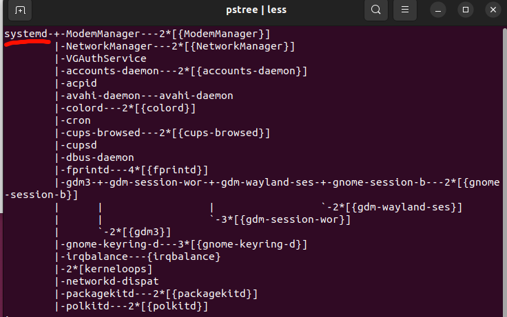
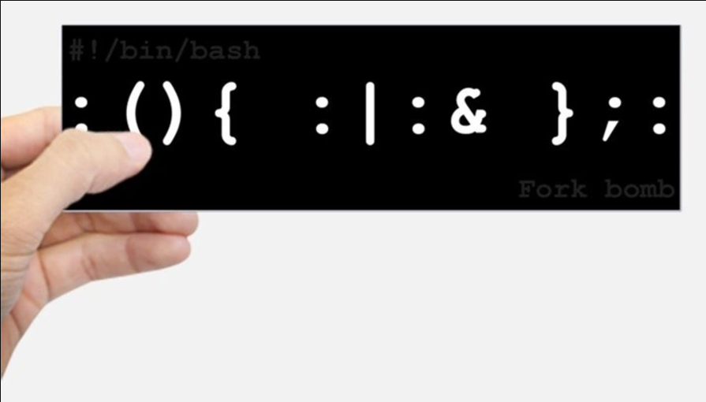
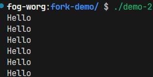
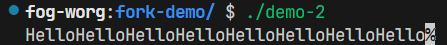
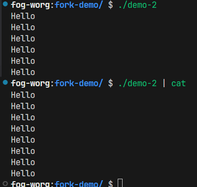
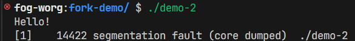
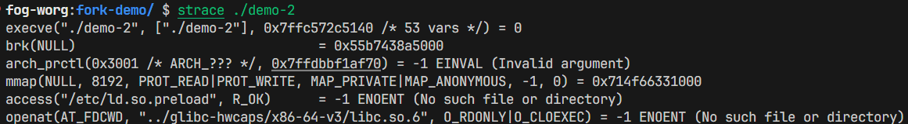
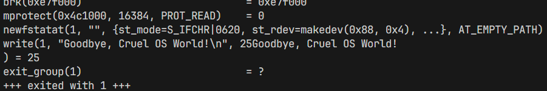
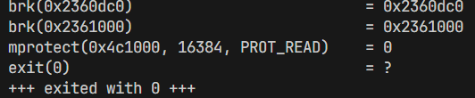

>**背景回顾**：有关状态机、并发和中断的讨论给我们真正理解操作系统奠定了基础，现在我们正式进入操作系统和应用程序的 “边界” 了。让我们把视角回到单线程应用程序，即 “执行计算指令和系统调用指令的状态机”，开始对操作系统和进程的讨论。

**本讲内容**：操作系统上的进程

- 操作系统上的第一个进程
- UNIX/Linux 进程管理 API:  *fork* ,  `execve` , *exit*

<!-- more --->

## 加载第一个进程

### 操作系统的启动流程

> 起点：CPU Reset，得到 **硬件的初始状态**

#### *Firmware* 阶段

- CPU Reset 后，*Firmware* 代码开始执行
- 加载操作系统，得到 **操作系统的初始状态**

#### 操作系统初始化阶段

- 操作系统扫描系统中的硬件、初始化数据结构……
- 加载第一个进程 (状态机)，得到 **该状态机的初始状态**

> 既然操作系统在初始化阶段会加载第一个进程，那么我们可不可以控制这个行为，让操作系统在初始化阶段加载 **我们指定的已经编译好的程序** 并将这个状态机加载为进程？
>
> *ATFAI*

#### 操作系统执行阶段

- 状态机在 CPU 上执行 (**控制权被移交给第一个进程**)
- 允许执行 `syscall` 进入操作系统代码

整个 *Linux* 的 “世界” **都是从这个进程开始**，并通过一系列实现进程管理的操作系统 API 创建的。



## 创建新进程

在 *Linux* 系统完成初始化之后，我们已经有了第一个状态机。

想要创建计算机世界的话，也许需要一个能够 “创建状态机” 的 API。

*UNIX* 给出的答案是：`fork()` 。它是 UNIX 世界中 **唯一** 能够创建状态机的方法。

```C title="fork() 声明"
pid_t fork(void);
```

### `fork`

`fork()` 对当前程序的状态 (也就是当前状态机) 做一个完整的复制，包括但不限于 **寄存器现场** 、 **内存** 等。

但是返回值略微有些差异 (`%rax` 寄存器中的值会有差异)，可以借此来区分状态机的父子关系：

- 对于父进程来说，得到的返回值为子进程 ID
- 对于子进程来说，得到的返回值为 0

我们可以从状态机的视角来理解 `fork()` 的行为：

- 将父状态机的状态 **完整拷贝** 一份，形成子状态机 (子进程)
- 同时为这一对状态机之间构建父子关系
  - 有了父子关系，我们就有了 `pstree`

- 如果复制失败则返回 `-1`

### *`Fork` Bomb*

顾名思义，这是一场由 `fork` 引发的 "事故"。

它的想法很简单：

- 新建状态机需要资源
  - 那么一直创建就会让系统 :boom:



```bash title="小型 fork bomb"
:(){:|:&};:   # 刚才的一行版本

:() {         # 格式化一下
  : | : &
}; :

f() {      # bash: 允许冒号作为 identifier
  f | f &
}
f
```

你可以把它理解成递归：

- 首次执行 `f` 的时候，`f` 尝试着创建一个管道，管道两头均为 `f`
- 后续...聪明的你应该已经想到了

### 理解 `fork` —— 练习

::: tip 提示

采用状态机的视角能够更好地帮助你分析程序的行为。

:::

#### 练习 1

```C title="exercise 1"
pid_t x = fork();
pid_t y = fork();
printf("%d %d\n", x, y);
```

对于这类程序，我们最需要关注的一些重要问题：

- 到底创建了几个状态机？
- `pid` 分别是多少？
  - “状态机视角” 帮助我们严格理解

#### 练习 2

```C title="exercise 2"
// Exer 2.1
for (int i = 0; i < 2; i++) {
    fork();
    printf("Hello\n");
}

// Exer 2.2
for (int i = 0; i < 2; i++) {
    fork();
    printf("Hello");
}
```

- 使用 "状态机视角" 可以帮助我们严格理解程序的实际行为
  - 计算机系统里 **没有魔法**
  - (无情执行指令的) **机器永远是对的**

::: warning 警告

::: center

请先自行尝试理解程序行为后再进一步编写程序验证!

:::

我们把 `for` 循环拆出来看看：

```C title="拆解 for 循环"
int main()
{
    // int i = 0;
    fork();
    printf("...");

    // int i = 1;
    fork();
    printf("...");
}
```

那么这两段程序都在依序做这几条指令：

1. `fork()`
2. `print`
3. `fork()`
4. `print`

那我们也可以依序分析状态机在各个步骤的状态 (以 2.1 为例)：

1. `PC = 1` : `fork()` 创建了一个新的状态机，因此当前持有：状态机 (`PC = 1`) * 2
2. `PC = 2` : `printf` , 因此输出两行 `Hello`
3. `PC = 3` : `fork()` , 当前持有： 状态机 (`PC = 3`) * 4
4. `PC = 4` : `printf` , 再输出四行 `Hello`

我们可以跑个程序验证一下：

```C title="测试程序"
#include <unistd.h>
#include <stdio.h>

int main() {
    for (int i = 0; i < 2; i++) {
        fork();
        printf("Hello\n");
    }
}
```



看样子程序执行结果很符合我们的预期。

那再看看 2.2 ?




并且，似乎还有更匪夷所思之事...



::: center

别急，**机器永远是对的**。那到底什么地方出问题了呢？

:::

- 似乎只能从程序入手了
  - `fork()` 包没问题的 —— 它只负责完整复制当前状态
  - 那 ... 难道是 `printf` 的问题？

来看一个例子吧：

```C title="内容能否被正常打印?"
#include <stdio.h>

int main()
{
    printf("Hello!\n");
    printf("Hello!");
    // 非法操作
    *((int*)NULL) = 0;
}
```

它的执行结果是这样的：



为什么只有 **一个** Hello 被正常打印出来了呢？

是因为 `printf` 缓冲区刷新策略的问题。详见 [setbuf(3) - Linux manual page](https://www.man7.org/linux/man-pages/man3/setbuf.3.html)

三类缓冲模式大致如下：

- `unbuffered` : 无缓冲模式。即刻打印待输出的字符。
- `line-buffered` : 行缓冲模式。遇到换行符 `\n` 后打印。(终端默认模式)
- `fully-buffered` : 无限缓冲区模式。(待求证) 程序返回后打印。(重定向、管道等场景默认模式)

所以，对待 2.2 代码的时候，我们需要把待执行的指令序列修改一下：

1. `fork()`
2. `buffer += A`
3. `fork()`
4. `buffer += A`
5. `flush(buffer)`

试着再来分析一下吧，记住，程序就是状态机！而 `fork()` 会将状态 **完全** 拷贝！

> 启示：因为计算机总是在执行指令，因此你总是能找到 "破坏" 你对这个程序行为正常预期的那一条指令，然后...重构模型，~~或者干掉它~~。

## 运行可执行文件

> 虽然说 `fork()` 能够创造出计算机世界，但是这种实现好像和我们见到的不是那么一样 —— 我们可以通过双击或命令行等方式来启动一个应用程序 —— 而这个应用程序 **在行为上** 几乎不大可能是第一个进程的副本 。所以我们可能会想 : 操作系统里面应该不只有 `fork()` 才对。那么该如何运行可执行程序呢？

### 借助 `execve` 运行可执行文件

> 为了运行可执行文件，UNIX 给出的答案是 `execve` 。

```C title="execve 声明"
int execve(const char *filename,
           char * const argv[], char * const envp[]);
```

从状态机的视角来看，`execve` 的作用就是 **重置状态机** —— 将当前进程重置为指定的可执行文件对应的初始状态 (夺舍说是)，即原进程中的状态被完全替换为这个可执行程序对应的初始状态。

::: tip 插曲

> 那么，什么是可执行文件呢？

还是从状态机的视角出发，可执行文件就是 **一个状态机初始化状态的描述**。

:::

`execve` 这一系统调用的行为可以描述如下：

- 执行名为 `filename` 的程序
- 允许对新状态机设置参数 `argv` (v) 和环境变量 `envp` (e)
  - 刚好对应了 `main()` 的参数！
- `execve` 是 **唯一** 能够 “执行程序” 的系统调用
  - 因此也是一切进程 `strace` 的第一个系统调用



### 创建一个新的以指定可执行程序为初始状态的状态机

也许聪明的你已经想到了 —— `fork()` + `execve()` 就能够办到这件事！

```C title="sys_spwan()"
int pid = fork();
if (pid == -1) {
    perror("fork"); goto fail;
} else if (pid == 0) {
    // Child
    execve(...);
    perror("execve"); goto fail;
} else {
    // Parent
    ...
}
```

### 环境变量

环境变量代表了应用程序执行的环境信息。

- 我们可以在终端中使用 `env` 命令进行查看
  - `PATH`: 可执行文件搜索路径
  - `PWD`: 当前路径
  - `HOME`: home 目录
  - `DISPLAY`: 图形输出
  - `PS1`: shell 的提示符
- `export` : 告诉 shell 在创建子进程时设置环境变量
  - 小技巧：`export ARCH=x86_64-qemu` 或 `export ARCH=native`

## 退出程序

> `fork()` 与 `execve()` 的组合已经能够完成创建计算机世界的两个主要部分 —— 复制 与 替换。而 复制 + 替换 = 自由执行任意可执行程序。
>
> 然后你会发现 ： 我们的叉叉到哪里去了？或者说，我们该如何销毁一个状态机？

UNIX 给出的答案是 : `_exit()`

### `_exit()` —— 销毁状态机

```C title="exit 的声明"
void _exit(int status);
```

它的行为可以描述如下：

- 立即销毁当前状态机，并且允许有一个返回值 `status`
- 子进程被销毁时会通知父进程

`_exit()` 的行为似乎非常简单易懂。并且它也可以处理父子进程相关的一些问题。

但是对于 **多线程程序** 来说呢？

这种单一的行为似乎就不太能满足我们的需求了。因此结束程序执行不止这一种方法。

### 终止程序执行的三种方法

> `int atexit(void (*__func)(void))`
>
> Register a function to be called when normal `exit` is called.

- `exit(0)`
  - 会调用 `atexit`
- `_exit(0)`
  - 执行 `exit_group` 系统调用终止整个进程 (**所有线程**)
    - 细心的同学已经在 `strace` 中发现了
  - 会调用 `atexit` 吗？
- `syscall(SYS_exit, 0)`
  - 执行 “exit” 系统调用终止 **当前线程**
  - 会调用 `atexit` 吗？





## 总结

因为 **“程序 = 状态机”**，操作系统上进程 (运行的程序) 管理的 API 很自然地就是状态机的管理。

在 UNIX/Linux 世界中，以下三个系统调用创建了整个 “进程世界”，不论是我们常用的 IDE 和浏览器，还是编译时在后台调用的 gcc。其中:

- `fork` 对当前状态机状态进行 **完整复制**

- `execve` 将当前状态机状态 **重置** 为某个可执行文件描述的状态机

- `exit` 可以 **销毁** 当前状态机。(它有很多种写法，具体的作用也不大相同，稍微留心一下就好)

在对这些概念有了绝对正确且绝对严谨的理解后，操作系统也就显得不那么神秘了。
