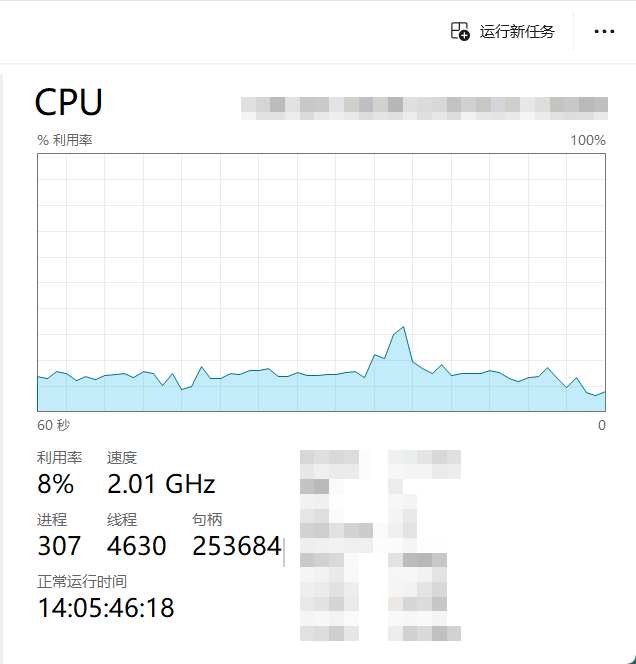
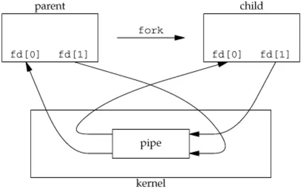
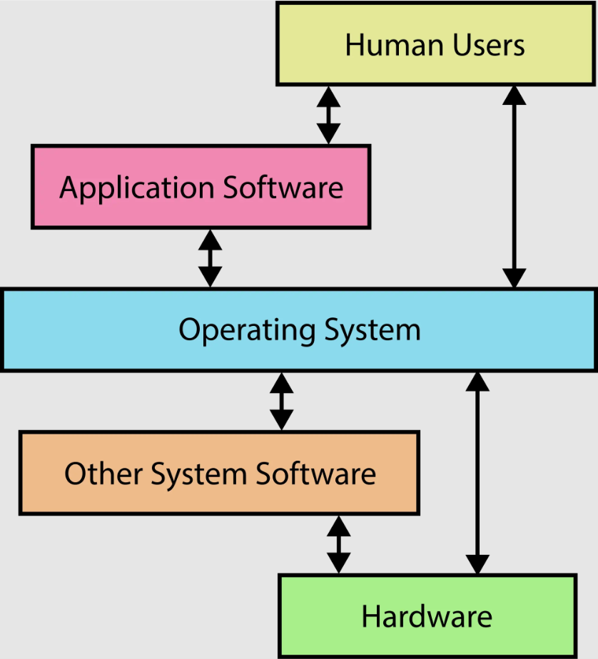

> **背景回顾**：整个计算机系统世界的 “创建” 从 CPU Reset 开始，Firmware 加载操作系统内核代码，操作系统成为状态机的管理者，初始化第一个进程，从而成为一个中断处理程序和系统调用执行者。《操作系统》课程的很重要部分就是操作系统中的对象和操纵这些对象的 API——我们已经学习了 fork, execve, exit, 和 mmap (munmap/mprotect)。如何用这些 API，以及更多的 API，实现丰富的应用程序？

**本讲内容**：一些操作系统 API 的补充；UNIX Shell 实现。

<!-- more --->

## 更多的操作系统 API

我们在编程的时候，可以把指针指向任意一个地址空间 ~~(会不会崩溃另说)~~：

```C title="使用指针来访问对应的地址空间"
void *p = (void*) 0x1234567LL;
```

但是你发现，我们似乎无法直接通过上面这种方式来将指针指向 **操作系统中的对象**。

> 操作系统中的对象：
>
> - 文件：有 “名字” 的对象
> - 可以看成 字节流 (终端) 或字节序列 (普通文件；包括 `/proc/*`)

有些时候，我们的程序需要获取操作系统对象中的信息来进行一定的处理，那么我们该如何得到指向操作系统对象的指针呢？

UNIX 的答案是：**文件描述符** 。

### 文件描述符

文件描述符的 **定义**

- 指向操作系统对象的 “指针”
  - Everything is a file
  - 通过指针可以访问 “一切”
- (C/C++程序) 对操作系统对象访问的 **核心** 机制 与 **底层** 途径
  - open, close, read/write (解引用), lseek (指针内赋值/运算), dup (指针间赋值)

::: info Windows 下的文件描述符

Windows 中的文件描述符叫做 *handle* (句柄 ~~神人翻译，但是可以考古~~)。使用 `Ctrl + Shift + Esc` 这一组合快捷键打开任务管理器。

在 **"性能"** 选项卡下的 CPU 数据界面中，你可以看到当前的 "句柄" 个数：



如果按照正经翻译来的话，*handle* 其实还蛮 "传神" 的：

*Handle* **(把手；握把；把柄)**

- 比 *file descriptor* 更像 “指针”
- 你有一个 *handle* 在我手上，我就可以更好地控制你


如果我们把 **操作系统对象** 想象成上图的 **锅**，把 **文件描述符** 想象成上图的 **"把柄"** ，也许就能够更好地理解文件描述符的作用 —— 在不知道锅内部状态的情况下直接操作锅可能是很 **危险** :warning: 的行为！

::: tip 是否感觉 *handle* 有点熟悉？

看到 *handle* 这个词有没有想到 [M4](https://jyywiki.cn/OS/2024/labs/M4.md) 中打开共享库时需要进行的操作 `dlopen()` 呢？

```C title="打开共享库"
// 打开共享库
handle = dlopen("libfoo.so", RTLD_LAZY);
if (!handle) {
    // 发生了错误
}
```

:::

### 管道

操作系统对象除了上述的内容以外，还有一类很特殊的操作系统对象 —— 管道 (pipe)。

> 详见 `man 2 pipe`

管道由读者/写者共享

- 读口：支持 `read`
- 写口：支持 `write`
- 不能够做出类似于从管道中间取内容的行为！

UNIX 中提供了 `pipe` 函数的声明：

```C title="pipe 函数的声明"
int pipe(int pipefd[2]);
```

- 返回两个文件描述符
  - `pipefd[0]` 为读口
  - `pipefd[1]` 为写口
- 如你所见，进程 **同时** 拥有了读口和写口的文件描述符
  - 看起来没用？不，`fork` 就有用了
    

管道实际上存在着一些 **同步** 的行为

- 读的时候如果没有内容会等待，直到管道中有内容并接收后才会释放
- 写的时候如果内容没有被读取会等待，直到管道中有 reader 的时候才将内容写入缓冲区并释放
  - 因为没有 reader 的时候操作系统是不会维护缓冲区的
  - writer 打算放入的东西就无处可放，所以会等待
- 管道其实是有缓冲区的：POSIX 最低标准 512 字节，Linux 4096 字节
  - 如果单次写超过了这个缓冲区的话?
    - !!当然是会被拆分成多次 write 啦!!
    - 去读 `man 7 pipe` !


## 操作系统的外壳



虽然说我们在绪论中为操作系统建模的时候绘制了这么一幅图，并且我们说：

- *Everything is a state machine*
- 操作系统 = 对象 + API
- 操作系统 = C 程序
- ...

但是 **我们眼中的操作系统** 似乎与上面的模型很不一样：

- 我们实际上 **"看不到"** 操作系统
- 看到的是 **使用系统调用的应用程序**
- 因此有一个应用程序是特殊的
  - 它可以直接和用户交互
  - 通过它可以配置操作系统、启动/管理其他应用

### *Shell* —— Kernel 的外壳

*Shell* 是一个特殊的应用程序，它完成了对操作系统内核的封装,实现了 *Kernel* - *Shell* - *I/O Devices* - *Human user* 之间的连接。

说到底，其实 UNIX Shell 是一个 **“把用户指令翻译成系统调用”** 的 **编程语言**。

- [M4](https://jyywiki.cn/OS/2024/labs/M4.md) 中介绍的 *repl* 与 *Shell* 也非常相似。
  - “搭建一个临时工具组合”

```less title="Shell & C"
fog-worg:pipe/ $ ls ; ls                                                                             
anonymous-pipe  anonymous-pipe.c  Makefile  named-pipe  named-pipe.c  README.md
anonymous-pipe  anonymous-pipe.c  Makefile  named-pipe  named-pipe.c  README.md

list_all_files() ; list_all_files();
```

**优点：高效、简洁、精确** 

- 一种 “自然编程语言”
- 短短一行命令，即可协同多个程序执行
- 我们已经看过很多例子了
  - `make -nB | grep ...`

**缺点：新手不友好** 

- 你需要了解很多工具和它们的命令行参数
- *“Unix is user-friendly; it's just choosy about who its friends are.”*

::: center

去从手册中发掘 *Shell* (对当前的你来说) 的更多可能，相信收获会非常大！

:::

## 经典复刻之路 Level 1: *UNIX Shell*

::: note 重走经典之路

不知不觉中，我们已经拥有了实现 UNIX 系统内全部机制的系统调用：

- 进程管理
  - fork, execve, exit

- 内存管理
  - mmap, munmap, mprotect

- 文件管理
  - open, close, read, write, lseek, dup

- 进程间通信
  - pipe, wait

~~或许实现 UNIX 系统已经不再是难事了！~~

:thinking: 我们可以自己复刻一下 UNIX 系统中的一些内容吗？

- 先从最外层开始吧！

::: info 提示

本节主要是阅读代码为主，因此本节课后续没有记笔记。

老师主要讲了一下 python + .gdb scripts + gdb 的调试技巧，同时课上还带着调试了一下 xv6 那边的 *freestanding shell* 的实现。

强烈建议课后自行阅读并理解 `sh.c` 这份代码！

:::

## 总结

通过 *freestanding 的 shell*，我们阐释了 **“可以在系统调用上创建整个操作系统应用世界”** 的真正含义：操作系统的 API 和应用程序是互相成就、螺旋生长的：有了新的应用需求，就有了新的操作系统功能。而 UNIX 为我们提供了一个非常精简、稳定的接口 (fork, execve, exit, pipe ,...)，纵然有沉重的历史负担，它在今天依然工作得很好。